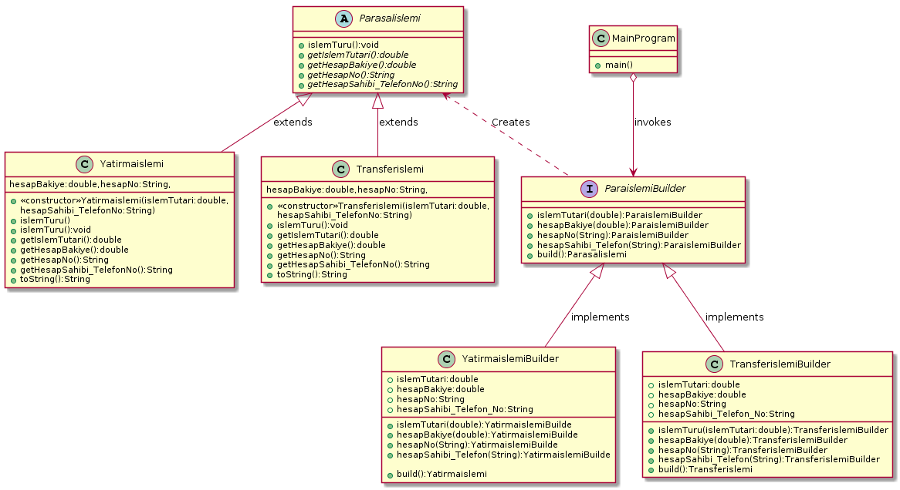
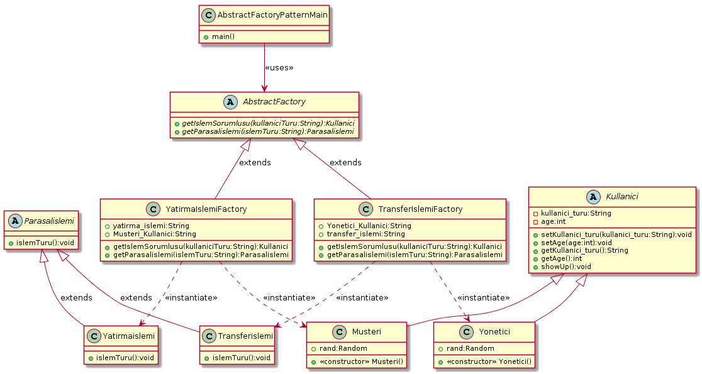

#### Tasarım Örüntülerin Dersinin Projesi:

Bu projede 12 tane tasarım deseni uygulanmıştır. Projenin Genel Yapısı Gösteren Uml Class Diagramı(Şeması) aşağıdaki gibidir:

image::Donem_Projesi_Uml/PLANTUml_For_Full_Project.png[]

## Yarartımsal(Creational) tasarım desenleri:
Bu paternler, yazılım nesnelerinin nasıl yaratılacağı hakkında genel olarak öneriler sunarak kullandığı 
esnek yapı sayesinde daha önceden belirlenen durumlara bağlı olarak gerekli nesneleri yaratır. Yaratımsal(Creational) desenler, 
hangi nesnenin çağrılması gerektiğini izlemeden sistemin uygun nesneyi çağırmasını sağlayan tasarım kalıplarıdır. 
Nesnelerin yaratılması gerektiği durumlarda uygulamaya farkedilebilir bir esneklik katar. Esas amaç, 
iyi bir yazılımın içinde barındırdığı nesnelerin nasıl yaratıldığından bağımsız olarak tasarlanması gerekliliğidir.

### * 1). Singleton Pattern: 
Creatinal patterns grubuna ait singleton tasarım deseni (Singleton design pattern) bir nesnenin application pool kapanana kadar 
bir kez üretilmesini kontrol altında tutar. Aynı zamanda bu nesne sınıf dışından da erişilebilinir olur. 
Bir sınıfın bir anda sadece bir örneğinin olması istenildiği zamanlarda kullanılır. 
Örneğin veritabanı uygulamalarında bir anda bir bağlantı nesnesinin olması sistem 
kaynaklarının verimli bir şekilde kullanılmasını sağlar.

#### Singleton tasarım deseninin uml şeması aşağıdaki gibidir :

image::Donem_Projesi_Uml/singleton_pattern_genel_uml_diagram.jpg[230,250]

#### Örnek:
Bu patern Bir sınıfın bir anda sadece bir örneğinin olması istenildiği zamanlarda kullanıldığından dolayı biz de Hesap Bankalarında olan hesap Bakiyesi nesnesi için kullandık sonuçta 
tek nesne yaratılmak istenir ve yapaılan değişiklikler(Para yatırma ,Para çekme işlemleri vb.) aynı nesne üzerinden yapılacatır.
. Örnek uygulamamızda hesapBakiye sınıfının sadece örneğine
erişebilen public static bir metot oluşturulmuştur(CreateObject() metodu). Bu metot eğer sınıfın örneği
oluşturulmadıysa oluşturur ve oluşturulmuş olan
örneği döndürür.Uygulamanın class diyagramlari aşağıdaki gibidir.

#### *Singleton Pattern Ornegi icin UML class diyagram :

image::Donem_Projesi_Uml/SingletonPattern_ClassDiagram_Image.png[]

### * 2). Factory Pattern: 
Bazı nesneler doğrudan kullanıcı tarafından yaratılması istenmemektedir(new ile yartma işlemi). Yani bazı nesneler kullanıcıdan gizlenmiştir. 
Asıl amaç, oluşturmak istediğimiz sınıfın kendisinden bir örnek istemek yerine Factory Metod patterni sayesinde tek bir instance üzerinden gerekli nesnenin üretilmesini sağlamaktır. Algoritmada belirli adımlarda farklı tiplerde nesnelere ihtiyacınız olabilir. Bu nesneleri if – else veyahut switch yapıları aracılığıyla, duruma göre oluşturabiliriz. Örneğin SystemElementFactory sınıfının createKullanici() isimli üyesi factory method durumundadır. Kullanici sample = SystemElementFactory.createKullanici(); kullanici türünden nesne geri döndürülür.

#### Factory tasarım deseninin uml şeması aşağıdaki gibidir :

image::Donem_Projesi_Uml/Factory_Patern_Genel_UML.gif[]

#### 1.Örnek:
Bu örnek uygulamamızda parasal işlemi türlerinden olan transfer işlemi,yatırma işlemi ve borç kredi işlemi bu işlemler direk kullanıcıdan yaratılmak istemediğimizden dolayı ParasalislemiFactory sınıfının CreateIslem metodunu kullanarak tek bir instance(Parasalislemi) üzerinden gerekli nesnenin üretilmesi sağlamaktadır. Uygulamanın class diyagramlari aşağıdaki gibidir.

#### *Factory Pattern Ornegi icin UML class diyagram :

image::Donem_Projesi_Uml/Factory_ClassDiagram_Example_1.png[]

#### 2.Örnek:
Bu örnek uygulamamızda Kullanıcı türlerinden olan müşteri ve yönetici nesnelerini direk kullanıcıdan yaratılmak istemediğimizden dolayı SystemElementFactory sınıfının createKullanici metodunu kullanarak tek bir instance(Kullanici) üzerinden gerekli nesnenin üretilmesi sağlamaktadır. Uygulamanın class diyagramlari aşağıdaki gibidir.

#### *Factory Pattern Ornegi icin UML class diyagram :

image::Donem_Projesi_Uml/Factory_ClassDiagram_Example_2.png[]

### * 3). Prototype Pattern: 
Prototype (prototip) tasarım deseni creational grubununa ait, var olan nesnelerin kopyasının üretiminden sorumlu tasarım desenidir.

Bazı nesnelerin üretilme maliyeti oldukça yüksek olabilir. Veya aynı değerlerde nesne üretilmesi gereken durumlar olabilir. 
Böyle nesnelerin üretim maliyetini azaltmak için var olan nesnenin kopyasının üretilmesi yoluna gidilebilinir.

#### Prototype tasarım deseninin genel uml şeması aşağıdaki gibidir :

image::Donem_Projesi_Uml/prototype_genel_diagram.png[350,400]

#### Deep Copy ve Shallow Copy Arasındaki fark :
Shallow Copy yüzeysel kopyalama aynı adresi işaret eden yeni bir nesne üretilmekte, var olan nesne üzerine referanslar ile işaretleme yapılmaktadır.
Deep Copy ise Derin kopyalama nesneler birebir kopyalanabilmekte ve bu kopya sonucu ile asıl nesne farklı referanslar ile işaretlenebilmekte.
Yüzeysel kopyalama basit nesneler için kullanışlı olmasına rağmen başka nesneleri referans eden nesneler için yetersiz kalır. Derin kopyalamada nesnenin referans ettiği nesneleri
de kopyalar.Deep copy ile Shallow copy arasındaki fark gösteren resim aşağıdaki gösterilmekte:

#### 1.Örnek:
Bu örnek uygulamamızda mevcut olan kullancı(Müşteri veya yönetici) bilgilerini yüzeysel/derin kopyalama prototipi uygulanmak isteniyor. Bu kopyalama işlemi işimizi kolaylaştırıp
işelmin maliyetini azaltıyor ve var olan nesnenin kopyasını üretilir.Uygulamanın class diyagramlari aşağıdaki gibidir.

#### *Prototype Pattern Ornegi icin UML class diyagram :

image::Donem_Projesi_Uml/Prototype_ClassDiagram_Example_1.png[]

#### 2.Örnek:
Bu örnek uygulamamızda mevcut olan kullancı(Müşteri veya yönetici) bilgilerini yüzeysel/derin kopyalama prototipi uygulanmak isteniyor. Bu kopyalama işlemi işimizi kolaylaştırıp
işelmin maliyetini azaltıyor ve var olan nesnenin kopyasını üretilir.Uygulamanın class diyagramlari aşağıdaki gibidir.

#### *2.Ornegin UML class diyagrami :

image::Donem_Projesi_Uml/Prototype_ClassDiagram_Example_2.png[]

### * 4). Object Pool Pattern: 
Çok kullanıcıya hizmet veren ağır iş yükü altındaki uygulamalar da genelde orta
katmandaki iş nesnelerinin application server’da havuzlanması ya da veritabnanı
bağlantılarının havuzlanması bu paternin tipik uygulamalarıdır. İstemcilerin ihtiyaç
duyduğu anda böyle bir nesneyi yaratmaktansa, daha önceden yaratılmış hazır bir
nesnenin ullanılmak üzere havuzdan çıkarılarak istemciye tahsis edilmesi, istemcinin
nesneyle işini bitirdikten sonra da nesneyi yok etmeksizin tekrar havuza geri atması bu
tür durumlarda sıklıkla kullanılan ve performansı da ciddi şekilde arttıran bir yöntemdir.

#### Object Pool tasarım deseninin genel uml şeması aşağıdaki gibidir :

image::Donem_Projesi_Uml/ObjectPoolPattern_1.PNG[450,520]

#### Örnek:
Bu örnek uygulamamızda sistemde kullanıcıya sınırlı sayıda oturum ayarlanmakta. Banka sistemine atak gerçekleştirememek için kullanıcıya sınırlı sayıda oturum ayarlanıyor oturum havuzu
mevcuttur eğer oturumu açılmak isteniyorsa havuzdan yer ayarlanıyor eğer oturumu kapatılmak isteniyorsa havuza nesneyi geri döndürülüyor.Uygulamanın class diyagramlari aşağıdaki gibidir.

#### *Object Pool Pattern Ornegi icin UML class diyagram :

image::Donem_Projesi_Uml/Object Pool_Pattern_Ornegi_icin_UML_Class_Diyagrami.png[]

### * 5). Builder Pattern : 
Builder (İnşaatçı) tasarım deseni creational grubununa ait, biden fazla parçadan oluşan nesnelerin üretilmesinden sorumlu bir tasarım desenidir.
Kompleks yapıya sahip nesneleri ve birden fazla girişe sahip olan nesneleri oluşturmak için kullanılır.Kompleks ürünün farklı paraçalarla oluşturulup farklı 
sunumların elde edilmesidir.

#### Builder desenini oluşturan 4 yapı vardır:

* Product: Oluşturulan nesne.
* Builder: Product oluşturacak nesnelerin (Concrete Builder) uygulaması gereken arayüz.
* Concrete Builder: Product nesnesini oluşturan nesne veya özelliklerin oluşturulduğu sınıflar. 
Her concrete builder sınıfı aynı arayüzde farklı bir ürünün oluşturulmasını sağlar.
* Director: Verilen builder nesnesine göre product örneği oluşturur.

#### Builder tasarım deseninin genel uml şeması aşağıdaki gibidir :

image::Donem_Projesi_Uml/builder_pattern.PNG[]

#### Örnek:
Örnek uygulamamızda islemTutari, hesapBakiye, hesapNo ve hesapSahibi_Telefon_No özellikleri olan bir Parasal işlemi nesnemiz olsun. 
Bu parasal işlemi(Yatırma işlemi veya Transfer işlemi) nesnemizin özelliklerinin farklı değerler alması 
ile farklı özelliklerde parasal işlemi(Yatırma işlemi veya Transfer işlemi) nesnesi üretebiliriz. Builder tasarım deseni ile bu senaryoyu gerçekleştirelim. 
.Uygulamanın class diyagramlari aşağıdaki gibidir.

#### *Builder Pattern Ornegi icin UML class diyagram :

### * 6). Abstract Factory Pattern: 
Benzer özelliklere sahip objeler varsa, veya birden fazla ürün ailesi çalışmak zorunda kaldığımızda kullanacağımız ürün ailesi ile istemci tarafı soyutlamak için kullanılır
"Abstract Factory" birbirleriyle ilişkili yada birbirlerine bağlı olan nesnelerin oluşturulmasını en etkin bir şekilde çözmeyi hedefler. 
Bu hedefe ulaşmak için soyut sınıflardan(abstract class) veya arayüzlerden(interface) yoğun bir şekilde faydalanmaktadır. 
"Abstract Factory" deseninin ana teması belirli sınıfların içerdiği ortak arayüzü soyut bir sınıf yada arayüz olarak tasarlamaktır. 
Böylece nesneleri üreten sınıf, hangi nesnenin üretileceği ile pek fazla ilgilinmesi gerekmez. İlgilenmesi gereken nokta oluşturacağı 
nesnenin hangi arayüzleri desteklediği yada uyguladığıdır. Bahsi geçen mekanizmalarla deseni oluşturduğumuz anda çalışma zamanında hangi 
nesnenin oluşturulması gerektiğini bilmeden nesnelerin oluşturulmasını yönetebiliriz. 

Eğer bir nesne oluşturacaksanız ve tam olarak hangi nesnenin oluşturulacağına bir switch yada if deyimi ile karar veriyorsanız muhtemelen 
her nesneyi oluştruduğunuzda aynı switch yapısını kullanmak zorunda kalacaksınız. Bu tür tekrarları önlemek için "Abstarct Factory" deseninden 
faydalanılabilir. Bu elbetteki nesnelerin ortak bir arayüzü uygulamış olma zorunluluğunun getirdiği bir faydadır.

#### Abstract Factory tasarım deseninin genel uml şeması aşağıdaki gibidir :

image::Donem_Projesi_Uml/abstract factory diagram.png[600,500]

#### Örnek:
Bu örnek uygulamada Abstract Factory paterni uygulandı iki tane Factoryimiz mevcuttur YatirmaIslemiFactory'i Kullanarak Yatırma İşlemi ve Sorumlusu Olan Müşteri Kullanıcımızı Oluşturuluyor.
TransferIslemiFactory ise Transfer İşlemi ve Sorumlusu Olan Yönetici Kullanıcımızı Oluşturuyor. Uygulamanın class diyagramlari aşağıdaki gibidir.

#### *Abstract Factory Pattern Ornegi icin UML class diyagram :

*_*_*_*_*_*_*_*_*_*_*_*_*_*_*_*_*_**_*_*_*_*_*_*_*_*_*_*_*_*_*_*_*_*_**_*_*_*_*_*_*_*_*_*_*_*_*_*_*_*_*_**_*_*_*_*_*_*_*_*_*_*_*_*_*_*_*_*_*_*_*_*_*_*_*_*_*_*_*_*_*_*_**_*_*_*_*_*_*_*_*_*_*_*_*_*_*_*_*_**_*_*_*_*_*_*_*_*_*_*_*_*_*_*_*_*_**_*_*_*_*_*_*_*_*_*_*_*_*_*_*_*

## Davranışsal(Behavioral) tasarım desenleri:
Yazılım mühendisliğinde davranışsal tasarım kalıpları, soruna göre nesneler arası ortak haberleşmeyi en iyi şekilde kurmamıza öneriler sunan tasarım kalıplarıdır. 
Böylece, bu örüntüler bu iletişimi gerçekleştirmede esnekliği arttırır.

### * 7). Iterator Pattern: 
Iterterator (tekrarlayıcı) tasarım deseni, behavior grubununa ait, nesne koleksyonlarının (list,array,queue) elemanlarını belirlenen kurallara göre elde edilmesini düzenleyen tasarım desenidir.ator Pattern :
terator (tekrarlayıcı) tasarım deseni, behavior grubununa ait, nesne koleksyonlarının (list,array,queue) elemanlarını belirlenen kurallara göre elde edilmesini düzenleyen tasarım desenidir.

Iterator tasarım deseni ile koleksiyon yapısı bilinmesine ihtiyaç olmadan koleksiyon elemanları üzerinde işlem yapılabilmesini sağlar. Yani iterator tasarım deseni kullanılarak koleksiyonun array, queue, 
list olması önemli olmadan, aynı şekilde elemanlarının elde edilmesi sağlanır.

#### Iterator tasarım deseninin uml şeması aşağıdaki gibidir :

image::Donem_Projesi_Uml/Iterator_genel_uml.png[iterator]

#### Örnek:
Örnek uygulamamızda Musteri Iterator ve Yonetici Iterator sınıfılarını oluşturduk. Bu Iteratorlar Müşteri ve Yönetici koleksiyon listelerinde içinde
dolaşmamızı sağlar koleksiyonun iç yapısı bilmeden. MusteriContainer sınıfında Musteri sınıfından bir arraylist oluşturulur elemanları eklenir,
YoneticiContainer ise Yonetici sınıfından oluşturulan nesneleri Hashtable setinde sklanır. Böylece Iterator deseni gerçekleştirmiş oluruz ve koleksiyon yapısı bilinmesine ihtiyaç olmadan koleksiyon elemanları 
üzerinde işlem yapılabilmesini sağlanmış olur.Uygulamanın class diyagramlari aşağıdaki gibidir.

#### *Musteri Iterator ve MusteriContainer Ornegi icin UML class diyagram :

image::Donem_Projesi_Uml/Musteri Iterator ve MusteriContainer Ornegi icin UML class diyagram Example_1.png[]

#### *Yonetici Iterator ve YoneticiContainer Ornegi icin UML class diyagram :

image::Donem_Projesi_Uml/Yonetici Iterator Ornegi icin UML class diyagram Example_2.png[]

### *8). Observer Pattern :
Observer tasarım deseni behavior grubununa ait, bir nesnede meydana gelen değişikliklerde içinde bulundurduğu listede bulunan nesnelere haber gönderen tasarım desenidir.
Observer tasarım deseni; birbirleri ile bire çok (yani bir nesnenin içinde başka bir nesnenin listesinin bulunması olarak düşünebiliriz) ilişki olan nesneler arasında olay bazlı bir etkileşim olduğu durumları düzenler.

#### Observer tasarım deseninin uml şeması aşağıdaki gibidir :

image::Donem_Projesi_Uml/observer_genel_yapi_uml.jpg[observer,350,250]

#### Örnek:
Örnek uygulamamızda Observer Bankanın kullanıcıları ve Subject(Observable) nesnesi Bankaların kampanya mesajları olsun. Bu şekilde Obsever tasarım deseni uygulanmış olur ve yeni bilgilendirme mesajları geldikçe kampanya uyarısına üye olan banka kullanıcılarına bildirim gönderilir.

Uygulamanın class diyagramı aşağıdaki gibidir.

image::Donem_Projesi_Uml/Observer_Pattern_Ornegi_icin_UML_Class_Diyagrami.png[600,700]

### * 9). Mediator Pattern :
Mediator design pattern (aracı tasarım deseni), behavior grubununa ait, çalışmaları birbirleri ile aynı arayüzden türeyen nesnelerin durumlarına bağlı olan nesnelerin davranışlarını düzenleyen tasarım desenidir.

Bazı durumlarda nesnelerin davranışları kendi türünden başka nesnelere bağlı olabilir. Mediator tasarım deseni birbirleri ile ilişkili olan bu nesneler arasında ki iletişimin ana bir nesne üzerinden (mediator) yapılmasını sağlar. Böylece nesneler arasındaki bağ zayıflatılır ve geliştirme aşamasında kod karmaşasını önler ve kodun yönetilmesini kolaylaştırır.

#### Mediator tasarım deseninin uml şeması aşağıdaki gibidir :

image::Donem_Projesi_Uml/mediator_pattern_genel_uml.png[350,450]

*  ConcreteColleague: ConcreteMediator üzerinden birbirleri ile ilişkili nesnelerdir. Colleague arayüzünü uygularlar.
#### Örnek:
Örnek uygulamamızda Merkezi Banka nesnesi olsun bu Merkezi bankamız Meditaor(ara bulucu) sayılır, birden fazla Banka Şübeleri yönetsin
bir banka şübesi tarafından gönderilen bilgilerndirme mesajı diğer banka şübelere iletilme işlemini yönetilsin böylece
Mediator tasarım desenini uygulanmış oluruz. Bu tasarımın önemi nesneler arasındaki bağ zayıflatılır ve geliştirme
aşamasında kod karmaşasını önler ve kodun yönetilmesini kolaylaştırır.

image::Donem_Projesi_Uml/Mediator_Pattern_Ornegi_icin_UML_Class_Diyagrami.png[]

### * 10). Memento Pattern :
Memento tasarım deseni behavior grubununa ait, bir nesnenin tamamının veya bazı özelliklerinin tutularak sonradan tekrar elde edilmesini yöneten tasarım desenidir. 
Memento tasarım deseni nesnenin bir halinin kopyasını alıp sonra bu kopyanın tekrar elde edilmesini sağlar. Genelde geri al işlemi için kullanılır. 

#### Memento tasarım deseni 3 yapıdan oluşur:

*  Originator: Tamamının veya bazı özelliklerinin kopyasının tutulacağı nesnedir. Memento nesnesini oluşturan ve geri yüklenmesinden sorumludur.

*  Memento: Originator nesnesinin saklanacak özelliklerinin tanımlı olduğu nesne.

*  Caretaker: Saklanacak olan memento nesnesinin referansını içinde barındıran nesnedir.
#### Memento tasarım deseninin uml şeması aşağıdaki gibidir :

image::Donem_Projesi_Uml/memento_pattern_uml_diagram.jpg[memento]

#### Örnek:
Örnek uygulamamızda Banka hesabi nesnesi olsun ve bu nesne üzerinde memento tasarım desenini uygulandı. Bu tasarımın önemi banka hesabinin geçmiş durumları kaydetmemizi sağlar, banka hesabinin durumları 3 durumdan oluşur (Açık, kapatıldı, donduruldu). Kullanıcı istediği zaman hesabin geçmişini görüntüleyebilir. Uygulamanın class diyagramı aşağıdaki gibidir.

image::Donem_Projesi_Uml/Memento_Pattern_Ornegi_icin_UML_Class_Diyagrami.png[]

###  11). MVC Tasarım Deseni:
MVC, başlıkta da belirttiğim gibi Model, View ve Controller kelimelerinden oluşturulmuş bir yazılım geliştirme desenidir. Masaüstü, web veya mobil uygulamaların hepsine uyarlanarak kullanılabilir. Fakat özellikle web projelerinin yapısına uygun olduğu için tercih edilmektedir. MVC deseni ( pattern ) Asp.Net ile ortaya çıkan bir desen değildir. Son 20 yıldır kullanılmakta olan fakat Asp.Net MVC ile popülerliği artmış bir desendir.

#### MVC paterni 3 yapıdan (Model, View ve Controller) oluşmaktadır :

* 1-Model: Model, proje içerisinde kullanılacak olan nesnelerin oluşturulduğu kısımdır. Günlük hayattaki somut nesnelerin, bilgisayar ortamında modellenmesi anlamına gelir. Örneğin bir kütüphane otomasyonu yapmak istediğimizde kitap bilgilerinin tutulacağı bir modele ihtiyaç duyulacaktır. Bu modelde kitabın seri numarası, adı, yazarı, yayınevi gibi bilgileri yer alacaktır.

* 2-View: Proje tamamlandığında kullanıcının gördüğü arayüzdür. Bu bir web sayfası, masaüstü uygulaması arayüzü veya mobil bir tasarım olabilir. Projenin yapısına göre bu tasarım farklı şekillerde oluşturulabilir.

* 3-Controller: Projedeki tüm işlemlerin (veritabanı işlemleri, hesaplamalar, veri aktarımı v.b) yapıldığı kontrol bölümüdür. Controller ayrıca model ve view arasındaki veri akışını da kontrol eder.

#### MVC Genel Yapısını Açıklayan Diyagram Aşağıdaki Gibidir:
image::Donem_Projesi_Uml/MVC genel uml diagrami.png[600,700]

*_*_*_*_*_*_*_*_*_*_*_*_*_*_*_*_*_**_*_*_*_*_*_*_*_*_*_*_*_*_*_*_*_*_**_*_*_*_*_*_*_*_*_*_*_*_*_*_*_*_*_**_*_*_*_*_*_*_*_*_*_*_*_*_*_*_**_*_*_*_*_*_*_*_*_*_*_*_*_*_*_**_*_*_*_*_*_*_*_*_*_*_*_*_*_*_*_*_**_*_*_*_*_*_*_*_*_*_*_*_*_*_*_*_*_**_*_*_*_*_*_*_*_*_*_*_*_*_*_*_*

## Yapısal(structural ) tasarım desenleri:
Yapısal(structural) tasarım desenleri, nesnelerin birbirleri ile olan ilişkilerini düzenleyen desenlerdir.

### * 12). Adapter Pattern: 
Adapter tasarım deseni; structural grubuna ait, uygulamada ki bir yapıya dışarıdaki bir yapıyı uygulamayı düzenleyen bir tasarım desenidir.

Bazı durumlarda zaten var olan başka bir yapıyı uygulamamız içinde ki bir yapıya uyarlayıp kullanmamız gerekebilir. 
Burada uyarlanacak yapı net kütüphanesi olması gerekmez. Com nesnesi gibi bir yapı da olabilir veya zaten geliştirdiğimiz 
uygulamadaki başka bir yapı da olabilir. Bu uyarlama işlemini yazacağımız bir Adapter nesnesi ile sağlayabiliriz. 
Adapter tasarım deseninin uml şeması aşağıdadır.

#### Adapter tasarım deseninin genel uml şeması aşağıdaki gibidir :

image::Donem_Projesi_Uml/adapter_genel_yapi_uml.png[600,500]

#### Örnek:
Örnek uygulamamızda adapter pattern uygulandı var olan başka bir yapıyı uygulamanın içinde ki başka bir yapıya uyarlayıp kullanmamız gerekebiliyor, bu yüzden DolarBirimi_Adaptee sınıfı ParaBirimi arayüzünden türetilen TürkLiraBirimi sınıfına uyarlamak için ParaBirimi arayüzünden türetilen ParaBirimiAdapter adapteri kullanıldı. Uygulamanın class diyagramlari aşağıdaki gibidir.

#### *Adapter Pattern Ornegi icin UML class diyagram :

image::Donem_Projesi_Uml/Adapter_Pattern_Ornegi_icin_UML_Class_Diyagrami.png[600,750]
