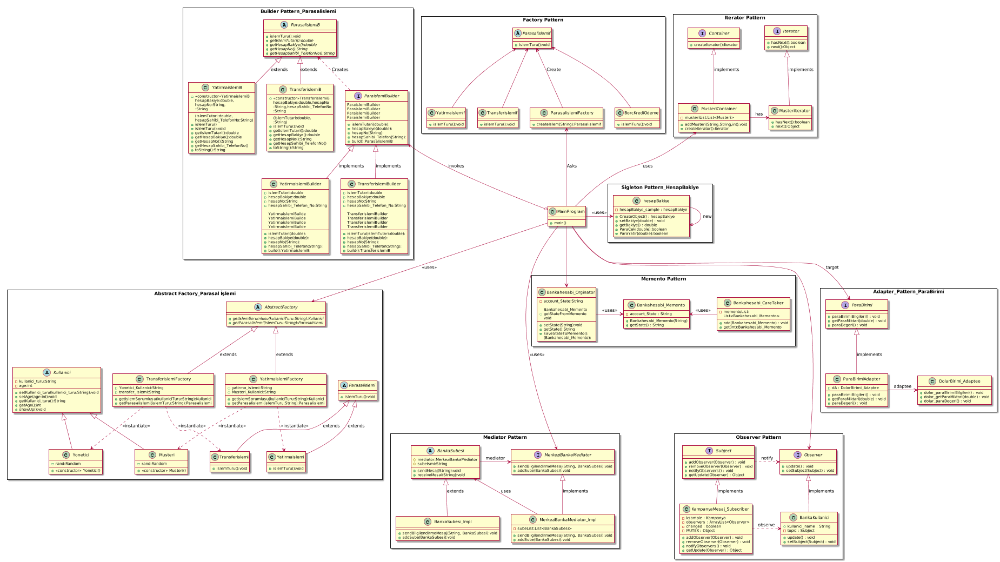

#### Tasarım Örüntülerin Dersinin Projesi:

Bu projede Banka Otomasyonuna 12 tane tasarım deseni uygulanmıştır. Projenin Genel Yapısı Gösteren Uml Class Diagramı(Şeması) aşağıdaki gibidir:

#### Banka Otomasyon Projesi İki Farklı Şekilde Geliştirilmiştir. 
#### 1) Full Project With Interface : Burada arayüzle geliştirilmeye çalışıldı, buttonları ekleyip buttonları etkin hale getirilip her tasarım desene özel çıktı sağlanır. Sonuçlar örneğin (Adapter pattern ve Observer patter) için aşağıdaki fotoğraflarda gösterildi gibi:

image::Donem_Projesi_Uml/Adapter.PNG[]

image::Donem_Projesi_Uml/Observer.PNG[]

#### 2) Full Project without Interface Just From Console's Screen:
[Source,]
----
### Singleton Design Pattern's Example is Runing ###

obj1-Bakiye : 2000,00 
obj2-Bakiye : 2000,00 
obj3-Bakiye : 2000,00 

obj1-Bakiye : 3000,00 
obj2-Bakiye : 3000,00 
obj3-Bakiye : 3000,00 

Yatırılacak Paranın Tutarı:250,00 TL dir
250,00 TL Hesabınıza Başarıyle Yatırıldı !!
obj1-Bakiye : 3250,00 
obj2-Bakiye : 3250,00 
obj3-Bakiye : 3250,00 
*-*-*-*-*-*-*-*-*-*-*-*-*-*-*-*-*-*-*-*-*-*-*-*-*-*-*-*-*-*-*-*-*-*

### Factory Design Pattern's Example is Runing [Example 1]###

Para transfer işlemi gerçekleşecektir!!

Borç/kredi ödeme işlemi gerçekleşecektir!!
*-*-*-*-*-*-*-*-*-*-*-*-*-*-*-*-*-*-*-*-*-*-*-*-*-*-*-*-*-*-*-*-*-*

### Factory Design Pattern's Example is Runing [Example 2]###

Kullanıcı türü :[Yönetici], Kullanıcı Yaşı:[28]
Kullanıcı türü :[Müşteri], Kullanıcı Yaşı:[43]
Kullanıcı türü :[Müşteri], Kullanıcı Yaşı:[34]
Kullanıcı türü :[Müşteri], Kullanıcı Yaşı:[61]
Kullanıcı türü :[Yönetici], Kullanıcı Yaşı:[23]
Kullanıcı türü :[Müşteri], Kullanıcı Yaşı:[22]
Kullanıcı türü :[Yönetici], Kullanıcı Yaşı:[53]
*-*-*-*-*-*-*-*-*-*-*-*-*-*-*-*-*-*-*-*-*-*-*-*-*-*-*-*-*-*-*-*-*-*

### Object Pool Design Pattern's Example is Runing ###

1. Oturum Objesi Ayarlandı (created)
2. Oturum Objesi Ayarlandı (created)
3. Oturum Objesi Ayarlandı (created)
4. Oturum Objesi Ayarlandı (created)
5. Oturum Objesi Ayarlandı (created)
6. Oturum Objesi Ayarlandı (created)
Thread 1==> 1. Kullanıcının Sistemde Oturumu Sağlandı(Açıldı)
Thread 2==> 2. Kullanıcının Sistemde Oturumu Sağlandı(Açıldı)
Thread 2==> 2. Kullanıcının Sistemde Oturumu Kapatıldı(Exite)
Thread 1==> 1. Kullanıcının Sistemde Oturumu Kapatıldı(Exite)
Thread 4==> 3. Kullanıcının Sistemde Oturumu Sağlandı(Açıldı)
Thread 3==> 4. Kullanıcının Sistemde Oturumu Sağlandı(Açıldı)
Thread 4==> 3. Kullanıcının Sistemde Oturumu Kapatıldı(Exite)
Thread 3==> 4. Kullanıcının Sistemde Oturumu Kapatıldı(Exite)
Thread 6==> 5. Kullanıcının Sistemde Oturumu Sağlandı(Açıldı)
Thread 5==> 6. Kullanıcının Sistemde Oturumu Sağlandı(Açıldı)
Thread 5==> 6. Kullanıcının Sistemde Oturumu Kapatıldı(Exite)
Thread 6==> 5. Kullanıcının Sistemde Oturumu Kapatıldı(Exite)
Thread 7==> 1. Kullanıcının Sistemde Oturumu Sağlandı(Açıldı)
Thread 7==> 1. Kullanıcının Sistemde Oturumu Kapatıldı(Exite)
Thread 8==> 2. Kullanıcının Sistemde Oturumu Sağlandı(Açıldı)
Thread 8==> 2. Kullanıcının Sistemde Oturumu Kapatıldı(Exite)
*-*-*-*-*-*-*-*-*-*-*-*-*-*-*-*-*-*-*-*-*-*-*-*-*-*-*-*-*-*-*-*-*-*

### Prototype Pattern's Example is Runing [Deep Copy] ###

Bankanın Orijinal(Asil) Müşterisi Oluşturuldu !!
Bankanın Clonelanan(DeepCopy) Müşterisi Oluşturuldu !!
Kullanıcı türü :[Müşteri], Kullanıcı Yaşı:[25]
Kullanıcı türü :[Müşteri], Kullanıcı Yaşı:[25]

orijinal Musterinin Adresi: 2016447921
Cloned Musterinin Adresi: 666641942

Clonelanan Müşterinin yaş değerini değiştirirsek orijinal müşterinin değeri değişmez, çünkü burada DeepCopy Cloning uygulandi!!
Kullanıcı türü :[Müşteri], Kullanıcı Yaşı:[25]
Kullanıcı türü :[Müşteri], Kullanıcı Yaşı:[36]
***********Deep Cloninig 2.metodu ile test etmek***********

****Sisteme Yeni Yöneticileri Eklenecek !!****
Bankanın Orijinal(Asil) Yöneticisi Oluşturuldu !!
Bankanın Clonelanan(DeepCopy Method_2) Yöneticisi Oluşturuldu !!
Kullanıcı türü :[Yönetici], Kullanıcı Yaşı:[61]
Kullanıcı türü :[Yönetici], Kullanıcı Yaşı:[61]

orijinal Yoneticinin Adresi: 960604060
Cloned Yoneticinin Adresi: 1349393271

Clonelanan Yöneticinin yaş değerini değiştirirsek orijinal yöneticinin değeri değişmez, çünkü burada DeepCopy Cloning 2.metod uygulandi!!
Kullanıcı türü :[Yönetici], Kullanıcı Yaşı:[61]
Kullanıcı türü :[Yönetici], Kullanıcı Yaşı:[65]
*-*-*-*-*-*-*-*-*-*-*-*-*-*-*-*-*-*-*-*-*-*-*-*-*-*-*-*-*-*-*-*-*-*

### Prototype Pattern's Example is Runing [Shallow Copy] ###

Bankanın Orijinal(Asil) Müşterisi Oluşturuldu !!
Bankanın Clonelanan(SallowCopy) Müşterisi Oluşturuldu !!
Bankanın Orijinal(Asil) Müşterisi Oluşturuldu !!
Kullanıcı türü :[Müşteri], Kullanıcı Yaşı:[60]
Kullanıcı türü :[Müşteri], Kullanıcı Yaşı:[60]

orijinal Musterinin Adresi: 1338668845
Cloned Musterinin Adresi: 1338668845

Clonelanan Müşterinin yaş değerini değiştirirsek orijinal müşterinin değeri de değişir, çünkü burada ShallowCopy Cloning uygulandi!!
Kullanıcı türü :[Müşteri], Kullanıcı Yaşı:[24]
Kullanıcı türü :[Müşteri], Kullanıcı Yaşı:[24]

****Sisteme Yeni Yöneticileri Eklenecek !!****
Bankanın Orijinal(Asil) Yöneticisi Oluşturuldu !!
Kullanıcı türü :[Yönetici], Kullanıcı Yaşı:[32]
Kullanıcı türü :[Yönetici], Kullanıcı Yaşı:[32]

orijinal Yoneticinin Adresi: 159413332
Cloned Yoneticinin Adresi: 1028214719

Clonelanan Yöneticinin yaş değerini değiştirirsek orijinal yöneticinin değeri de değişir, çünkü burada ShallowCopy Cloning uygulandi!!
Kullanıcı türü :[Yönetici], Kullanıcı Yaşı:[32]
Kullanıcı türü :[Yönetici], Kullanıcı Yaşı:[39]
*-*-*-*-*-*-*-*-*-*-*-*-*-*-*-*-*-*-*-*-*-*-*-*-*-*-*-*-*-*-*-*-*-*

### Builder Design Pattern's Example is Runing [Example 2] ###

Transfer Edilecek Para Tutari : 50,25TL
Para Transferi İçin Kullanılacak Hesabın Hesap Bakiyesi: 1000 TL
Para Transferi İçin Kullanılan Hesabın Hesap Numarasi:1235 6786 8335 4467
Hesap Sahibinin Telefon Numarasi : +90 5647869843
**** !! Para transfer işlemi başarıyla gerçekleştirilmiştir !! ****
Transferislemi [islemTutari=50,25TL , hesapBakiye=1000TL , hesapNo=1235 6786 8335 4467, hesapSahibi_Telefon_No=+90 5647869843]

Yatırım Edilecek Para Tutari : 100,95TL
Para Yatirma İşlemi İçin Kullanılacak Hesabın Hesap Bakiyesi: 34500 TL
Para Yatırma İşlemi İçin Kullanılan Hesabın Hesap Numarasi:4789 6786 9084 3267
Hesap Sahibinin Telefon Numarasi : +90 5268692843
**** !! Hesabınıza para yatırma işlemi başarıyla gerçekleştirilmiştir !! ****
Yatirmaislemi [islemTutari= 100,95 TL, hesapBakiye= 34500 TL, hesapNo=4789 6786 9084 3267, hesapSahibi_Telefon_No=+90 5268692843]

*-*-*-*-*-*-*-*-*-*-*-*-*-*-*-*-*-*-*-*-*-*-*-*-*-*-*-*-*-*-*-*-*-*

### Builder Design Pattern's Example is Runing ###

Kullanici adi=Saliha, kullanici soyadi=Uslu, age=30, TC_No=99345678930, Telefon_No=1234567, kullanici_adresi=Fake address 1234

Kullanici adi=Can, kullanici soyadi=Demir, age=30, TC_No=99336798930, Telefon_No=12967567, kullanici_adresi=Fake address 6588
*-*-*-*-*-*-*-*-*-*-*-*-*-*-*-*-*-*-*-*-*-*-*-*-*-*-*-*-*-*-*-*-*-*

### Abstract Factory Pattern's Example is Runing ###

YatirmaIslemiFactory'i Kullanarak Yatırma İşlemi ve Sorumlusu Olan Müşteri Kullanıcımızı Oluşturuluyor:
Hesaba para yatırma işlemi müşteri tarafından gerçekleştirilecektir!!
Kullanıcı türü :[Müşteri], Kullanıcı Yaşı:[44]

TransferIslemiFactory'i Kullanarak Transfer İşlemi ve Sorumlusu Olan Yönetici Kullanıcımızı Oluşturuluyor: 
Para transfer ettirme işlemi yönetici tarafından gerçekleştirilecektir!!
Kullanıcı türü :[Yönetici], Kullanıcı Yaşı:[37]

*-*-*-*-*-*-*-*-*-*-*-*-*-*-*-*-*-*-*-*-*-*-*-*-*-*-*-*-*-*-*-*-*-*

### Iterator Design Pattern's Example is Runing ###

--> Iterator Vasıtası İle Sistemin Müşterilerin Bilgileri Geri Göndermek!!

musteri_adi=Muhammed, musteri_soyadi=Kaya, age=24, kullanici_turu=Müşteri
musteri_adi=Caner, musteri_soyadi=Bulut, age=30, kullanici_turu=Müşteri
musteri_adi=Esma, musteri_soyadi=Bodur, age=27, kullanici_turu=Müşteri

--> Iterator Vasıtası İle Sistemin Yöneticilerin Bilgileri Geri Göndermek!!

yönetici_adi=Ahmet, yönetici_soyadi=Akbulut, age=45, kullanici_turu=Yönetici
yönetici_adi=Unal, yönetici_soyadi=Sayar, age=50, kullanici_turu=Yönetici
yönetici_adi=Merve, yönetici_soyadi=Ateş, age=37, kullanici_turu=Yönetici
*-*-*-*-*-*-*-*-*-*-*-*-*-*-*-*-*-*-*-*-*-*-*-*-*-*-*-*-*-*-*-*-*-*

### Observer Design Pattern's Example is Runing ###

Aykut Demir :: Kampanya Mesaji yoktur !!
Merve DoğanAy :: Kampanya Mesaji yoktur !!
Topic'a gönderilen kampanya mesajın bilgileri: 
Kampanyanın Başlığı: İlk Kampanyamız,
Kampanyanın İçeriği: Kampanyamiz Altin dovizi alimi ile ilgilidir, Kampanyanın Süresi:1 aydır
Aykut Demir :: Kampanya Mesaji vardir !! ==> Kampanyanın İçeriği: Kampanyamiz Altin dovizi alimi ile ilgilidir
Alp Erdoğan :: Kampanya Mesaji vardir !! ==> Kampanyanın İçeriği: Kampanyamiz Altin dovizi alimi ile ilgilidir
Merve DoğanAy :: Kampanya Mesaji vardir !! ==> Kampanyanın İçeriği: Kampanyamiz Altin dovizi alimi ile ilgilidir
---------------------------------------------------

Topic'a gönderilen kampanya mesajın bilgileri: 
Kampanyanın Başlığı: 2. Kampanyamız,
Kampanyanın İçeriği: Çocukların geleceği için kumbara kampanyasına katılın, Kampanyanın Süresi:2 aydır
Aykut Demir :: Kampanya Mesaji vardir !! ==> Kampanyanın İçeriği: Çocukların geleceği için kumbara kampanyasına katılın
Merve DoğanAy :: Kampanya Mesaji vardir !! ==> Kampanyanın İçeriği: Çocukların geleceği için kumbara kampanyasına katılın
---------------------------------------------------

*-*-*-*-*-*-*-*-*-*-*-*-*-*-*-*-*-*-*-*-*-*-*-*-*-*-*-*-*-*-*-*-*-*

### Mediator Design Pattern's Example is Runing ###

Istanbul Banka Şübesi Tarafından bu mesaj gönderildi : Tüm Şübelere Dikkatine 1. Bilgilendirme mesaji !!!
Ankara Banka Şübesi Tarafından bu mesaj alındı : Tüm Şübelere Dikkatine 1. Bilgilendirme mesaji !!!
İzmir Banka Şübesi Tarafından bu mesaj alındı : Tüm Şübelere Dikkatine 1. Bilgilendirme mesaji !!!
Bursa Banka Şübesi Tarafından bu mesaj alındı : Tüm Şübelere Dikkatine 1. Bilgilendirme mesaji !!!

Bursa Banka Şübesi Tarafından bu mesaj gönderildi : Tüm Şübelere Dikkatine 2. Bilgilendirme mesaji !!!
Istanbul Banka Şübesi Tarafından bu mesaj alındı : Tüm Şübelere Dikkatine 2. Bilgilendirme mesaji !!!
Ankara Banka Şübesi Tarafından bu mesaj alındı : Tüm Şübelere Dikkatine 2. Bilgilendirme mesaji !!!
İzmir Banka Şübesi Tarafından bu mesaj alındı : Tüm Şübelere Dikkatine 2. Bilgilendirme mesaji !!!
*-*-*-*-*-*-*-*-*-*-*-*-*-*-*-*-*-*-*-*-*-*-*-*-*-*-*-*-*-*-*-*-*-*

### Memento Design Pattern's Example is Runing ###

Banka hesabinin şimdiki Durumu: Donduruldu
Hesabın Kaydedilen İlk Durumu: Açık
Hesabın Kaydedilen İkinci Durumu: Kapatıldı
*-*-*-*-*-*-*-*-*-*-*-*-*-*-*-*-*-*-*-*-*-*-*-*-*-*-*-*-*-*-*-*-*-*

### Adapter Design Pattern's Example is Runing ###

Alışverişte Kullanılan Para Birimi: Türk Lirası
Alışverişte kullanılacak para miktarı = 1250,00 TL
Türk Lirası değeri Dolar cinsinden ==> 1 TL = 0.1653 Dolar 

Alışverişte Kullanılan Para Birimi: Dolar (USD)
Alışverişte kullanılacak para miktarı = 206,82 Dolar(USD)
Dolar değeri Türk Lirası cinsinden ==> 1 Dolar = 6.044 TL 

--------------------------------------------------------

*-*-*-*-*-*-*-*-*-*-*-*-*-*-*-*-*-*-*-*-*-*-*-*-*-*-*-*-*-*-*-*-*-*

----
