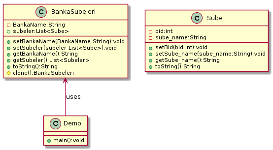

## Yarartımsal(Creational) tasarım desenleri:
Bu paternler, yazılım nesnelerinin nasıl yaratılacağı hakkında genel olarak öneriler sunarak kullandığı 
esnek yapı sayesinde daha önceden belirlenen durumlara bağlı olarak gerekli nesneleri yaratır. Yaratımsal(Creational) desenler, 
hangi nesnenin çağrılması gerektiğini izlemeden sistemin uygun nesneyi çağırmasını sağlayan tasarım kalıplarıdır. 
Nesnelerin yaratılması gerektiği durumlarda uygulamaya farkedilebilir bir esneklik katar. Esas amaç, 
iyi bir yazılımın içinde barındırdığı nesnelerin nasıl yaratıldığından bağımsız olarak tasarlanması gerekliliğidir.

### * Prototype Pattern: 
Prototype (prototip) tasarım deseni creational grubununa ait, var olan nesnelerin kopyasının üretiminden sorumlu tasarım desenidir.

Bazı nesnelerin üretilme maliyeti oldukça yüksek olabilir. Veya aynı değerlerde nesne üretilmesi gereken durumlar olabilir. 
Böyle nesnelerin üretim maliyetini azaltmak için var olan nesnenin kopyasının üretilmesi yoluna gidilebilinir.

#### Prototype tasarım deseninin genel uml şeması aşağıdaki gibidir :

image::prototype_genel_diagram.png[450,500]

#### Deep Copy ve Shallow Copy Arasındaki fark :
Shallow Copy yüzeysel kopyalama aynı adresi işaret eden yeni bir nesne üretilmekte, var olan nesne üzerine referanslar ile işaretleme yapılmaktadır.
Deep Copy ise Derin kopyalama nesneler birebir kopyalanabilmekte ve bu kopya sonucu ile asıl nesne farklı referanslar ile işaretlenebilmekte.
Yüzeysel kopyalama basit nesneler için kullanışlı olmasına rağmen başka nesneleri referans eden nesneler için yetersiz kalır. Derin kopyalamada nesnenin referans ettiği nesneleri
de kopyalar.Deep copy ile Shallow copy arasındaki fark gösteren resim aşağıdaki gösterilmekte:

image::ShallowCopy vs DeepCopy.png[]

#### 1.Örnek:
Bu örnek uygulamamızda mevcut olan kullancı(Müşteri veya yönetici) bilgilerini yüzeysel/derin kopyalama prototipi uygulanmak isteniyor. Bu kopyalama işlemi işimizi kolaylaştırıp
işelmin maliyetini azaltıyor ve var olan nesnenin kopyasını üretilir.Uygulamanın class diyagramlari aşağıdaki gibidir.

#### *Prototype Pattern Ornegi icin UML class diyagram :

image::Prototype_ClassDiagram_Example_1.png[]

#### *Prortype Pattern Örneğin Kodları:

.Kullanici.java
[source, java]
----
package Prototype_Pattern_Example1;

import java.io.Serializable;

public abstract class Kullanici implements Serializable,Cloneable {
	private static final long serialVersionUID = -1937047519230746677L;
	public String kullanici_turu;
	public int age;
	
	public void setKullanici_turu(String kullanici_turu){
		this.kullanici_turu = kullanici_turu;
	}
	public void setAge(int age){
		this.age = age;
	}
	public String getKullanici_turu(){
		return this.kullanici_turu;
	}
	public int getAge(){
		return this.age;	
	}
	
	
	public void showUp(){
		System.out.printf("Kullanıcı türü :[%s], Kullanıcı Yaşı:[%d]\n", getKullanici_turu(),getAge());
	}
	public abstract Kullanici makeShallowCopy(Kullanici orijinalKullanici);
	public abstract Kullanici makeDeepCopy() throws ClassNotFoundException;
	public abstract Kullanici makeDeepCopyMethod_2();
	
}
----
.Musteri.java
[source, java]
----
package Prototype_Pattern_Example1;

import java.io.ByteArrayInputStream;
import java.io.ByteArrayOutputStream;
import java.io.IOException;
import java.io.ObjectInputStream;
import java.io.ObjectOutputStream;
import java.util.Random;
public class Musteri extends Kullanici{
	private static final long serialVersionUID = 440347043243434494L;
	Random rand = new Random();

	public Musteri(){
		setKullanici_turu("Müşteri");
		int value = rand.nextInt(51)+20;
		setAge(value);
		System.out.println("Bankanın Orijinal(Asil) Müşterisi Oluşturuldu !!");
	}
	
	@Override
	public Musteri makeShallowCopy(Kullanici orijinalMusteri) {
		System.out.println("Bankanın Clonelanan(SallowCopy) Müşterisi Oluşturuldu !!");
		
		Musteri clonedMusteri = new Musteri();
		clonedMusteri=(Musteri)orijinalMusteri;
		return clonedMusteri;
	}
	
	@Override
	public Musteri makeDeepCopyMethod_2() {
		System.out.println("Bankanın Clonelanan(DeepCopy Method_2) Müşterisi Oluşturuldu !!");
		
		Musteri clonedMusteri = null;
		try {
			clonedMusteri = (Musteri) super.clone();
			
		} catch (CloneNotSupportedException e) {
			e.printStackTrace();
		}
		return clonedMusteri;
	}

	@Override
	public Musteri makeDeepCopy() throws ClassNotFoundException {
		System.out.println("Bankanın Clonelanan(DeepCopy) Müşterisi Oluşturuldu !!");
		try {
			//Serialization of object
	        ByteArrayOutputStream bos = new ByteArrayOutputStream();
			ObjectOutputStream out = new ObjectOutputStream(bos);
			out.writeObject(this);
		      //De-serialization of object
			ByteArrayInputStream bis = new ByteArrayInputStream(bos.toByteArray());
	        ObjectInputStream in = new ObjectInputStream(bis);
	        Musteri clonedMusteri = (Musteri) in.readObject();
	        return clonedMusteri;
		} catch (IOException e) {
			// TODO Auto-generated catch block
			e.printStackTrace();
			return null;
		}
        
	}
	
	
}	
----
.Yonetici.java
[source, java]
----
package Prototype_Pattern_Example1;

import java.io.ByteArrayInputStream;
import java.io.ByteArrayOutputStream;
import java.io.IOException;
import java.io.ObjectInputStream;
import java.io.ObjectOutputStream;
import java.util.Random;

public class Yonetici extends Kullanici{
	private static final long serialVersionUID = -6493171299609719559L;
	Random rand = new Random();
	
	public Yonetici(){
		setKullanici_turu("Yönetici");
		int value = rand.nextInt(51)+20;
		setAge(value);
		
		System.out.println("Bankanın Orijinal(Asil) Yöneticisi Oluşturuldu !!");
	}
	@Override
	public Yonetici makeShallowCopy(Kullanici orijinalYonetici) {
		
		try {
			return (Yonetici)super.clone();
		} catch (CloneNotSupportedException e) {
			// TODO Auto-generated catch block
			e.printStackTrace();
			return null;
		}
	}

	@Override
	public Yonetici makeDeepCopyMethod_2(){
		
		System.out.println("Bankanın Clonelanan(DeepCopy Method_2) Yöneticisi Oluşturuldu !!");
		
		Yonetici clonedYonetici = null;
		try {
			clonedYonetici = (Yonetici) super.clone();
			
		} catch (CloneNotSupportedException e) {
			// TODO Auto-generated catch block
			e.printStackTrace();
		}
		return clonedYonetici;
	}

	@Override
	public Yonetici makeDeepCopy() throws ClassNotFoundException {
		System.out.println("Bankanın Clonelanan(DeepCopy) Yöneticisi Oluşturuldu !!");
		try {
			//Serialization of object
	        ByteArrayOutputStream bos = new ByteArrayOutputStream();
			ObjectOutputStream out = new ObjectOutputStream(bos);
			out.writeObject(this);
		      //De-serialization of object
			ByteArrayInputStream bis = new ByteArrayInputStream(bos.toByteArray());
	        ObjectInputStream in = new ObjectInputStream(bis);
	        Yonetici clonedYonetici = (Yonetici) in.readObject();
	        return clonedYonetici;
		} catch (IOException e) {
			// TODO Auto-generated catch block
			e.printStackTrace();
			return null;
		}
	}
}
----
.CloneFactory.java
[source, java]
----
package Prototype_Pattern_Example1;

public class CloneFactory {
	
	public Kullanici getShallowClone(Kullanici kullaniciSample){
		return kullaniciSample.makeShallowCopy(kullaniciSample);
	}
	
	public Kullanici getDeepClone(Kullanici kullaniciSample) throws ClassNotFoundException{
		return kullaniciSample.makeDeepCopy();
	}
	
	public Kullanici getDeepCloneMethod_2(Kullanici kullaniciSample) {
		return kullaniciSample.makeDeepCopyMethod_2();
	}
}
----
.TestDeepCloning.java
[source, java]
----
package Prototype_Pattern_Example1;

public class TestDeepCloning {

	public static void main(String[] args) throws ClassNotFoundException {
		
		System.out.println("### Prototype Design Pattern's Example is Runing ###\n");

		CloneFactory kullaniciMaker = new CloneFactory();
		
		Musteri orijinalMusteri = new Musteri();
		Musteri clonedMusteri = (Musteri)kullaniciMaker.getDeepClone(orijinalMusteri);
		
		orijinalMusteri.showUp();
		clonedMusteri.showUp();
		System.out.println();
		
		System.out.println("orijinal Musterinin Adresi: "+ System.identityHashCode(orijinalMusteri));
		System.out.println("Cloned Musterinin Adresi: "+ System.identityHashCode(clonedMusteri));
		
		System.out.println();
		System.out.println("Clonelanan Müşterinin yaş değerini değiştirirsek orijinal müşterinin değeri değişmez, çünkü burada DeepCopy Cloning uygulandi!!");
		clonedMusteri.setAge(36);
		orijinalMusteri.showUp();
		clonedMusteri.showUp();
		
		System.out.println("***********Deep Cloninig 2.metodu ile test etmek***********");
		
		
		System.out.println("\n****Sisteme Yeni Yöneticileri Eklenecek !!****");
		Yonetici orijinalYonetici = new Yonetici();
		Yonetici clonedYonetici = (Yonetici)kullaniciMaker.getDeepCloneMethod_2(orijinalYonetici);
		
		orijinalYonetici.showUp();
		clonedYonetici.showUp();
		System.out.println();
		
		System.out.println("orijinal Yoneticinin Adresi: "+ System.identityHashCode(orijinalYonetici));
		System.out.println("Cloned Yoneticinin Adresi: "+ System.identityHashCode(clonedYonetici));
		
		System.out.println();
		System.out.println("Clonelanan Yöneticinin yaş değerini değiştirirsek orijinal yöneticinin değeri değişmez, çünkü burada DeepCopy Cloning 2.metod uygulandi!!");
		clonedYonetici.setAge(65);
		orijinalYonetici.showUp();
		clonedYonetici.showUp();
	}

}
----
.TestShallowCloning.java
[source, java]
----
package Prototype_Pattern_Example1;

public class TestShallowCloning {

	public static void main(String[] args) {
		// TODO Auto-generated method stub
		System.out.println("### Prototype Design Pattern's Example is Runing ###\n");

		CloneFactory kullaniciMaker = new CloneFactory();
		
		Musteri orijinalMusteri = new Musteri();
		Musteri clonedMusteri = (Musteri)kullaniciMaker.getShallowClone(orijinalMusteri);
		
		orijinalMusteri.showUp();
		clonedMusteri.showUp();
		System.out.println();
		
		System.out.println("orijinal Musterinin Adresi: "+ System.identityHashCode(orijinalMusteri));
		System.out.println("Cloned Musterinin Adresi: "+ System.identityHashCode(clonedMusteri));
		
		System.out.println();
		System.out.println("Clonelanan Müşterinin yaş değerini değiştirirsek orijinal müşterinin değeri de değişir, çünkü burada ShallowCopy Cloning uygulandi!!");
		clonedMusteri.age=24;
		orijinalMusteri.showUp();
		clonedMusteri.showUp();
		
		
		System.out.println("\n****Sisteme Yeni Yöneticileri Eklenecek !!****");
		Yonetici orijinalYonetici = new Yonetici();
		Yonetici clonedYonetici = (Yonetici)kullaniciMaker.getShallowClone(orijinalYonetici);
		
		orijinalYonetici.showUp();
		clonedYonetici.showUp();
		System.out.println();
		
		System.out.println("orijinal Yoneticinin Adresi: "+ System.identityHashCode(orijinalYonetici));
		System.out.println("Cloned Yoneticinin Adresi: "+ System.identityHashCode(clonedYonetici));
		
		System.out.println();
		System.out.println("Clonelanan Yöneticinin yaş değerini değiştirirsek orijinal yöneticinin değeri de değişir, çünkü burada ShallowCopy Cloning uygulandi!!");
		clonedYonetici.setAge(39);
		orijinalYonetici.showUp();
		clonedYonetici.showUp();
	}
}
----
#### Result:
[source, ]
----
### Prototype Design Pattern's Example is Runing ###

Bankanın Orijinal(Asil) Müşterisi Oluşturuldu !!
Bankanın Clonelanan(DeepCopy) Müşterisi Oluşturuldu !!
Kullanıcı türü :[Müşteri], Kullanıcı Yaşı:[27]
Kullanıcı türü :[Müşteri], Kullanıcı Yaşı:[27]

orijinal Musterinin Adresi: 2125039532
Cloned Musterinin Adresi: 189568618

Clonelanan Müşterinin yaş değerini değiştirirsek orijinal müşterinin değeri değişmez, çünkü burada DeepCopy Cloning uygulandi!!
Kullanıcı türü :[Müşteri], Kullanıcı Yaşı:[27]
Kullanıcı türü :[Müşteri], Kullanıcı Yaşı:[36]
***********Deep Cloninig 2.metodu ile test etmek***********

****Sisteme Yeni Yöneticileri Eklenecek !!****
Bankanın Orijinal(Asil) Yöneticisi Oluşturuldu !!
Bankanın Clonelanan(DeepCopy Method_2) Yöneticisi Oluşturuldu !!
Kullanıcı türü :[Yönetici], Kullanıcı Yaşı:[70]
Kullanıcı türü :[Yönetici], Kullanıcı Yaşı:[70]

orijinal Yoneticinin Adresi: 793589513
Cloned Yoneticinin Adresi: 1313922862

Clonelanan Yöneticinin yaş değerini değiştirirsek orijinal yöneticinin değeri değişmez, çünkü burada DeepCopy Cloning 2.metod uygulandi!!
Kullanıcı türü :[Yönetici], Kullanıcı Yaşı:[70]
Kullanıcı türü :[Yönetici], Kullanıcı Yaşı:[65]

### Prototype Design Pattern's Example is Runing ###

Bankanın Orijinal(Asil) Müşterisi Oluşturuldu !!
Bankanın Clonelanan(SallowCopy) Müşterisi Oluşturuldu !!
Bankanın Orijinal(Asil) Müşterisi Oluşturuldu !!
Kullanıcı türü :[Müşteri], Kullanıcı Yaşı:[27]
Kullanıcı türü :[Müşteri], Kullanıcı Yaşı:[27]

orijinal Musterinin Adresi: 692404036
Cloned Musterinin Adresi: 692404036

Clonelanan Müşterinin yaş değerini değiştirirsek orijinal müşterinin değeri de değişir, çünkü burada ShallowCopy Cloning uygulandi!!
Kullanıcı türü :[Müşteri], Kullanıcı Yaşı:[24]
Kullanıcı türü :[Müşteri], Kullanıcı Yaşı:[24]

****Sisteme Yeni Yöneticileri Eklenecek !!****
Bankanın Orijinal(Asil) Yöneticisi Oluşturuldu !!
Kullanıcı türü :[Yönetici], Kullanıcı Yaşı:[37]
Kullanıcı türü :[Yönetici], Kullanıcı Yaşı:[37]

orijinal Yoneticinin Adresi: 1554874502
Cloned Yoneticinin Adresi: 1846274136

Clonelanan Yöneticinin yaş değerini değiştirirsek orijinal yöneticinin değeri de değişir, çünkü burada ShallowCopy Cloning uygulandi!!
Kullanıcı türü :[Yönetici], Kullanıcı Yaşı:[37]
Kullanıcı türü :[Yönetici], Kullanıcı Yaşı:[39]
----

#### 2.Örnek:
Bu örnek uygulamamızda mevcut olan kullancı(Müşteri veya yönetici) bilgilerini yüzeysel/derin kopyalama prototipi uygulanmak isteniyor. Bu kopyalama işlemi işimizi kolaylaştırıp
işelmin maliyetini azaltıyor ve var olan nesnenin kopyasını üretilir.Uygulamanın class diyagramlari aşağıdaki gibidir.

#### *2.Ornegin UML class diyagrami :

#### *Prortype Pattern Örneğin Kodları:
.Sube.java
[source, java]
----
package Prototype_Pattern_Example2;

public class Sube{
	private int bid;
	private String sube_name;
	
	public int getBid() {
		return bid;
	}
	public void setBid(int bid) {
		this.bid = bid;
	}
	public String getSube_name() {
		return sube_name;
	}
	public void setSube_name(String sube_name) {
		this.sube_name = sube_name;
	}
	@Override
	public String toString() {
		return " [bid=" + bid + ", sube_name=" + sube_name + "]";
	}	
}
----
.BankaSubeleri.java
[source, java]
----
 package Prototype_Pattern_Example2;

import java.util.ArrayList;
import java.util.List;

public class BankaSubeleri implements Cloneable{
	
	private String BankaName;
	List<Sube> subeler=new ArrayList<Sube>();
	
	public String getBankaName() {
		return BankaName;
	}
	public void setBankaName(String BankaName) {
		this.BankaName = BankaName;
	}
	public List<Sube> getSubeler() {
		return subeler;
	}
	public void setSubeler(List<Sube> subeler) {
		this.subeler = subeler;
	}
	public void loadData(){
		
		for(int i=1;i<=4;i++){
			
			Sube s = new Sube();
			s.setBid(i);
			s.setSube_name("Sube "+i);
			getSubeler().add(s);
			
		}
	}
	@Override
	public String toString() {
		return "Banka Şubeleri: [BankaName= " + BankaName + ", subeler=" + subeler + "]";
	}
	@Override
	protected BankaSubeleri clone() throws CloneNotSupportedException {
		
		BankaSubeleri banka = new BankaSubeleri();
		
		for(Sube s : this.getSubeler()){
			banka.getSubeler().add(s);
		}		
		
		return banka;
	}	
}
----
.Demo.java
[source, java]
----
package Prototype_Pattern_Example2;

public class Demo {

	public static void main(String[] args) throws CloneNotSupportedException {
		System.out.println("### Prototype Design Pattern's Example is Runing ###\n");

		BankaSubeleri bs = new BankaSubeleri();
		bs.setBankaName("Ziraat Bankasi");
		bs.loadData();
		
		
		BankaSubeleri bs2 = new BankaSubeleri();
	
		
		System.out.print("Burada görüldüğü gibi DeepCopy uygulanmaktadır ilk Bankadan bir şubeyi silersek iknicisinde o şube silinmez/etkilmez!!");
		bs2 = bs.clone();
		bs2.setBankaName("Vakif Bankasi");
		bs.getSubeler().remove(2);
		
		System.out.println("\n");
		System.out.println(bs);
		System.out.println(bs2);

	}

}
----
#### Result:
[Source,]
----
### Prototype Design Pattern's Example is Runing ###

Burada görüldüğü gibi DeepCopy uygulanmaktadır ilk Bankadan bir şubeyi silersek iknicisinde o şube silinmez/etkilmez!!

Banka Şubeleri: [BankaName= Ziraat Bankasi, subeler=[ [bid=1, sube_name=Sube 1],  [bid=2, sube_name=Sube 2],  [bid=4, sube_name=Sube 4]]]
Banka Şubeleri: [BankaName= Vakif Bankasi, subeler=[ [bid=1, sube_name=Sube 1],  [bid=2, sube_name=Sube 2],  [bid=3, sube_name=Sube 3],  [bid=4, sube_name=Sube 4]]]
----
