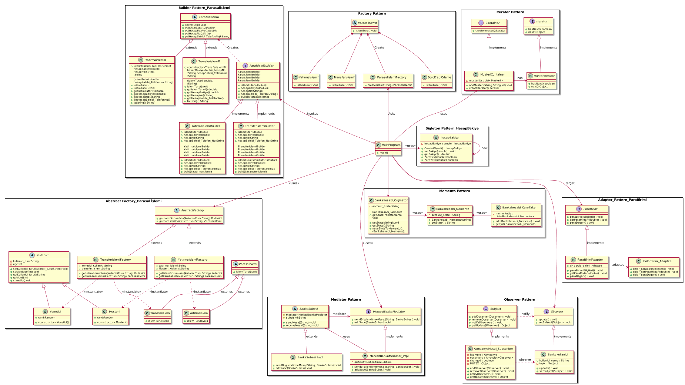

#### Tasarým Örüntülerin Dersinin Projesi:

Bu projede Banka Otomasyonuna 12 tane tasarým deseni uygulanmýþtýr. Projenin Genel Yapýsý Gösteren Uml Class Diagramý(Þemasý) aþaðýdaki gibidir:

#### Banka Otomasyon Projesi Ýki Farklý Þekilde Geliþtirilmiþtir. 
#### 1) Full Project With Interface : Burada arayüzle geliþtirilmeye çalýþýldý, buttonlarý ekleyip buttonlarý etkin hale getirilip her tasarým desene özel çýktý saðlanýr
sonuçlar örneðin (Adapter pattern ve Observer patter) için aþaðýdaki fotoðraflarda gösterildi gibi:

image::Donem_Projesi_Uml/Adapter.PNG[]

#### 2) Full Project without Interface Just From Console's Screen:
[Source,]
----
### Singleton Design Pattern's Example is Runing ###

obj1-Bakiye : 2000,00 
obj2-Bakiye : 2000,00 
obj3-Bakiye : 2000,00 

obj1-Bakiye : 3000,00 
obj2-Bakiye : 3000,00 
obj3-Bakiye : 3000,00 

Yatýrýlacak Paranýn Tutarý:250,00 TL dir
250,00 TL Hesabýnýza Baþarýyle Yatýrýldý !!
obj1-Bakiye : 3250,00 
obj2-Bakiye : 3250,00 
obj3-Bakiye : 3250,00 
*-*-*-*-*-*-*-*-*-*-*-*-*-*-*-*-*-*-*-*-*-*-*-*-*-*-*-*-*-*-*-*-*-*

### Factory Design Pattern's Example is Runing [Example 1]###

Para transfer iþlemi gerçekleþecektir!!

Borç/kredi ödeme iþlemi gerçekleþecektir!!
*-*-*-*-*-*-*-*-*-*-*-*-*-*-*-*-*-*-*-*-*-*-*-*-*-*-*-*-*-*-*-*-*-*

### Factory Design Pattern's Example is Runing [Example 2]###

Kullanýcý türü :[Yönetici], Kullanýcý Yaþý:[28]
Kullanýcý türü :[Müþteri], Kullanýcý Yaþý:[43]
Kullanýcý türü :[Müþteri], Kullanýcý Yaþý:[34]
Kullanýcý türü :[Müþteri], Kullanýcý Yaþý:[61]
Kullanýcý türü :[Yönetici], Kullanýcý Yaþý:[23]
Kullanýcý türü :[Müþteri], Kullanýcý Yaþý:[22]
Kullanýcý türü :[Yönetici], Kullanýcý Yaþý:[53]
*-*-*-*-*-*-*-*-*-*-*-*-*-*-*-*-*-*-*-*-*-*-*-*-*-*-*-*-*-*-*-*-*-*

### Object Pool Design Pattern's Example is Runing ###

1. Oturum Objesi Ayarlandý (created)
2. Oturum Objesi Ayarlandý (created)
3. Oturum Objesi Ayarlandý (created)
4. Oturum Objesi Ayarlandý (created)
5. Oturum Objesi Ayarlandý (created)
6. Oturum Objesi Ayarlandý (created)
Thread 1==> 1. Kullanýcýnýn Sistemde Oturumu Saðlandý(Açýldý)
Thread 2==> 2. Kullanýcýnýn Sistemde Oturumu Saðlandý(Açýldý)
Thread 2==> 2. Kullanýcýnýn Sistemde Oturumu Kapatýldý(Exite)
Thread 1==> 1. Kullanýcýnýn Sistemde Oturumu Kapatýldý(Exite)
Thread 4==> 3. Kullanýcýnýn Sistemde Oturumu Saðlandý(Açýldý)
Thread 3==> 4. Kullanýcýnýn Sistemde Oturumu Saðlandý(Açýldý)
Thread 4==> 3. Kullanýcýnýn Sistemde Oturumu Kapatýldý(Exite)
Thread 3==> 4. Kullanýcýnýn Sistemde Oturumu Kapatýldý(Exite)
Thread 6==> 5. Kullanýcýnýn Sistemde Oturumu Saðlandý(Açýldý)
Thread 5==> 6. Kullanýcýnýn Sistemde Oturumu Saðlandý(Açýldý)
Thread 5==> 6. Kullanýcýnýn Sistemde Oturumu Kapatýldý(Exite)
Thread 6==> 5. Kullanýcýnýn Sistemde Oturumu Kapatýldý(Exite)
Thread 7==> 1. Kullanýcýnýn Sistemde Oturumu Saðlandý(Açýldý)
Thread 7==> 1. Kullanýcýnýn Sistemde Oturumu Kapatýldý(Exite)
Thread 8==> 2. Kullanýcýnýn Sistemde Oturumu Saðlandý(Açýldý)
Thread 8==> 2. Kullanýcýnýn Sistemde Oturumu Kapatýldý(Exite)
*-*-*-*-*-*-*-*-*-*-*-*-*-*-*-*-*-*-*-*-*-*-*-*-*-*-*-*-*-*-*-*-*-*

### Prototype Pattern's Example is Runing [Deep Copy] ###

Bankanýn Orijinal(Asil) Müþterisi Oluþturuldu !!
Bankanýn Clonelanan(DeepCopy) Müþterisi Oluþturuldu !!
Kullanýcý türü :[Müþteri], Kullanýcý Yaþý:[25]
Kullanýcý türü :[Müþteri], Kullanýcý Yaþý:[25]

orijinal Musterinin Adresi: 2016447921
Cloned Musterinin Adresi: 666641942

Clonelanan Müþterinin yaþ deðerini deðiþtirirsek orijinal müþterinin deðeri deðiþmez, çünkü burada DeepCopy Cloning uygulandi!!
Kullanýcý türü :[Müþteri], Kullanýcý Yaþý:[25]
Kullanýcý türü :[Müþteri], Kullanýcý Yaþý:[36]
***********Deep Cloninig 2.metodu ile test etmek***********

****Sisteme Yeni Yöneticileri Eklenecek !!****
Bankanýn Orijinal(Asil) Yöneticisi Oluþturuldu !!
Bankanýn Clonelanan(DeepCopy Method_2) Yöneticisi Oluþturuldu !!
Kullanýcý türü :[Yönetici], Kullanýcý Yaþý:[61]
Kullanýcý türü :[Yönetici], Kullanýcý Yaþý:[61]

orijinal Yoneticinin Adresi: 960604060
Cloned Yoneticinin Adresi: 1349393271

Clonelanan Yöneticinin yaþ deðerini deðiþtirirsek orijinal yöneticinin deðeri deðiþmez, çünkü burada DeepCopy Cloning 2.metod uygulandi!!
Kullanýcý türü :[Yönetici], Kullanýcý Yaþý:[61]
Kullanýcý türü :[Yönetici], Kullanýcý Yaþý:[65]
*-*-*-*-*-*-*-*-*-*-*-*-*-*-*-*-*-*-*-*-*-*-*-*-*-*-*-*-*-*-*-*-*-*

### Prototype Pattern's Example is Runing [Shallow Copy] ###

Bankanýn Orijinal(Asil) Müþterisi Oluþturuldu !!
Bankanýn Clonelanan(SallowCopy) Müþterisi Oluþturuldu !!
Bankanýn Orijinal(Asil) Müþterisi Oluþturuldu !!
Kullanýcý türü :[Müþteri], Kullanýcý Yaþý:[60]
Kullanýcý türü :[Müþteri], Kullanýcý Yaþý:[60]

orijinal Musterinin Adresi: 1338668845
Cloned Musterinin Adresi: 1338668845

Clonelanan Müþterinin yaþ deðerini deðiþtirirsek orijinal müþterinin deðeri de deðiþir, çünkü burada ShallowCopy Cloning uygulandi!!
Kullanýcý türü :[Müþteri], Kullanýcý Yaþý:[24]
Kullanýcý türü :[Müþteri], Kullanýcý Yaþý:[24]

****Sisteme Yeni Yöneticileri Eklenecek !!****
Bankanýn Orijinal(Asil) Yöneticisi Oluþturuldu !!
Kullanýcý türü :[Yönetici], Kullanýcý Yaþý:[32]
Kullanýcý türü :[Yönetici], Kullanýcý Yaþý:[32]

orijinal Yoneticinin Adresi: 159413332
Cloned Yoneticinin Adresi: 1028214719

Clonelanan Yöneticinin yaþ deðerini deðiþtirirsek orijinal yöneticinin deðeri de deðiþir, çünkü burada ShallowCopy Cloning uygulandi!!
Kullanýcý türü :[Yönetici], Kullanýcý Yaþý:[32]
Kullanýcý türü :[Yönetici], Kullanýcý Yaþý:[39]
*-*-*-*-*-*-*-*-*-*-*-*-*-*-*-*-*-*-*-*-*-*-*-*-*-*-*-*-*-*-*-*-*-*

### Builder Design Pattern's Example is Runing [Example 2] ###

Transfer Edilecek Para Tutari : 50,25TL
Para Transferi Ýçin Kullanýlacak Hesabýn Hesap Bakiyesi: 1000 TL
Para Transferi Ýçin Kullanýlan Hesabýn Hesap Numarasi:1235 6786 8335 4467
Hesap Sahibinin Telefon Numarasi : +90 5647869843
**** !! Para transfer iþlemi baþarýyla gerçekleþtirilmiþtir !! ****
Transferislemi [islemTutari=50,25TL , hesapBakiye=1000TL , hesapNo=1235 6786 8335 4467, hesapSahibi_Telefon_No=+90 5647869843]

Yatýrým Edilecek Para Tutari : 100,95TL
Para Yatirma Ýþlemi Ýçin Kullanýlacak Hesabýn Hesap Bakiyesi: 34500 TL
Para Yatýrma Ýþlemi Ýçin Kullanýlan Hesabýn Hesap Numarasi:4789 6786 9084 3267
Hesap Sahibinin Telefon Numarasi : +90 5268692843
**** !! Hesabýnýza para yatýrma iþlemi baþarýyla gerçekleþtirilmiþtir !! ****
Yatirmaislemi [islemTutari= 100,95 TL, hesapBakiye= 34500 TL, hesapNo=4789 6786 9084 3267, hesapSahibi_Telefon_No=+90 5268692843]

*-*-*-*-*-*-*-*-*-*-*-*-*-*-*-*-*-*-*-*-*-*-*-*-*-*-*-*-*-*-*-*-*-*

### Builder Design Pattern's Example is Runing ###

Kullanici adi=Saliha, kullanici soyadi=Uslu, age=30, TC_No=99345678930, Telefon_No=1234567, kullanici_adresi=Fake address 1234

Kullanici adi=Can, kullanici soyadi=Demir, age=30, TC_No=99336798930, Telefon_No=12967567, kullanici_adresi=Fake address 6588
*-*-*-*-*-*-*-*-*-*-*-*-*-*-*-*-*-*-*-*-*-*-*-*-*-*-*-*-*-*-*-*-*-*

### Abstract Factory Pattern's Example is Runing ###

YatirmaIslemiFactory'i Kullanarak Yatýrma Ýþlemi ve Sorumlusu Olan Müþteri Kullanýcýmýzý Oluþturuluyor:
Hesaba para yatýrma iþlemi müþteri tarafýndan gerçekleþtirilecektir!!
Kullanýcý türü :[Müþteri], Kullanýcý Yaþý:[44]

TransferIslemiFactory'i Kullanarak Transfer Ýþlemi ve Sorumlusu Olan Yönetici Kullanýcýmýzý Oluþturuluyor: 
Para transfer ettirme iþlemi yönetici tarafýndan gerçekleþtirilecektir!!
Kullanýcý türü :[Yönetici], Kullanýcý Yaþý:[37]

*-*-*-*-*-*-*-*-*-*-*-*-*-*-*-*-*-*-*-*-*-*-*-*-*-*-*-*-*-*-*-*-*-*

### Iterator Design Pattern's Example is Runing ###

--> Iterator Vasýtasý Ýle Sistemin Müþterilerin Bilgileri Geri Göndermek!!

musteri_adi=Muhammed, musteri_soyadi=Kaya, age=24, kullanici_turu=Müþteri
musteri_adi=Caner, musteri_soyadi=Bulut, age=30, kullanici_turu=Müþteri
musteri_adi=Esma, musteri_soyadi=Bodur, age=27, kullanici_turu=Müþteri

--> Iterator Vasýtasý Ýle Sistemin Yöneticilerin Bilgileri Geri Göndermek!!

yönetici_adi=Ahmet, yönetici_soyadi=Akbulut, age=45, kullanici_turu=Yönetici
yönetici_adi=Unal, yönetici_soyadi=Sayar, age=50, kullanici_turu=Yönetici
yönetici_adi=Merve, yönetici_soyadi=Ateþ, age=37, kullanici_turu=Yönetici
*-*-*-*-*-*-*-*-*-*-*-*-*-*-*-*-*-*-*-*-*-*-*-*-*-*-*-*-*-*-*-*-*-*

### Observer Design Pattern's Example is Runing ###

Aykut Demir :: Kampanya Mesaji yoktur !!
Merve DoðanAy :: Kampanya Mesaji yoktur !!
Topic'a gönderilen kampanya mesajýn bilgileri: 
Kampanyanýn Baþlýðý: Ýlk Kampanyamýz,
Kampanyanýn Ýçeriði: Kampanyamiz Altin dovizi alimi ile ilgilidir, Kampanyanýn Süresi:1 aydýr
Aykut Demir :: Kampanya Mesaji vardir !! ==> Kampanyanýn Ýçeriði: Kampanyamiz Altin dovizi alimi ile ilgilidir
Alp Erdoðan :: Kampanya Mesaji vardir !! ==> Kampanyanýn Ýçeriði: Kampanyamiz Altin dovizi alimi ile ilgilidir
Merve DoðanAy :: Kampanya Mesaji vardir !! ==> Kampanyanýn Ýçeriði: Kampanyamiz Altin dovizi alimi ile ilgilidir
---------------------------------------------------

Topic'a gönderilen kampanya mesajýn bilgileri: 
Kampanyanýn Baþlýðý: 2. Kampanyamýz,
Kampanyanýn Ýçeriði: Çocuklarýn geleceði için kumbara kampanyasýna katýlýn, Kampanyanýn Süresi:2 aydýr
Aykut Demir :: Kampanya Mesaji vardir !! ==> Kampanyanýn Ýçeriði: Çocuklarýn geleceði için kumbara kampanyasýna katýlýn
Merve DoðanAy :: Kampanya Mesaji vardir !! ==> Kampanyanýn Ýçeriði: Çocuklarýn geleceði için kumbara kampanyasýna katýlýn
---------------------------------------------------

*-*-*-*-*-*-*-*-*-*-*-*-*-*-*-*-*-*-*-*-*-*-*-*-*-*-*-*-*-*-*-*-*-*

### Mediator Design Pattern's Example is Runing ###

Istanbul Banka Þübesi Tarafýndan bu mesaj gönderildi : Tüm Þübelere Dikkatine 1. Bilgilendirme mesaji !!!
Ankara Banka Þübesi Tarafýndan bu mesaj alýndý : Tüm Þübelere Dikkatine 1. Bilgilendirme mesaji !!!
Ýzmir Banka Þübesi Tarafýndan bu mesaj alýndý : Tüm Þübelere Dikkatine 1. Bilgilendirme mesaji !!!
Bursa Banka Þübesi Tarafýndan bu mesaj alýndý : Tüm Þübelere Dikkatine 1. Bilgilendirme mesaji !!!

Bursa Banka Þübesi Tarafýndan bu mesaj gönderildi : Tüm Þübelere Dikkatine 2. Bilgilendirme mesaji !!!
Istanbul Banka Þübesi Tarafýndan bu mesaj alýndý : Tüm Þübelere Dikkatine 2. Bilgilendirme mesaji !!!
Ankara Banka Þübesi Tarafýndan bu mesaj alýndý : Tüm Þübelere Dikkatine 2. Bilgilendirme mesaji !!!
Ýzmir Banka Þübesi Tarafýndan bu mesaj alýndý : Tüm Þübelere Dikkatine 2. Bilgilendirme mesaji !!!
*-*-*-*-*-*-*-*-*-*-*-*-*-*-*-*-*-*-*-*-*-*-*-*-*-*-*-*-*-*-*-*-*-*

### Memento Design Pattern's Example is Runing ###

Banka hesabinin þimdiki Durumu: Donduruldu
Hesabýn Kaydedilen Ýlk Durumu: Açýk
Hesabýn Kaydedilen Ýkinci Durumu: Kapatýldý
*-*-*-*-*-*-*-*-*-*-*-*-*-*-*-*-*-*-*-*-*-*-*-*-*-*-*-*-*-*-*-*-*-*

### Adapter Design Pattern's Example is Runing ###

Alýþveriþte Kullanýlan Para Birimi: Türk Lirasý
Alýþveriþte kullanýlacak para miktarý = 1250,00 TL
Türk Lirasý deðeri Dolar cinsinden ==> 1 TL = 0.1653 Dolar 

Alýþveriþte Kullanýlan Para Birimi: Dolar (USD)
Alýþveriþte kullanýlacak para miktarý = 206,82 Dolar(USD)
Dolar deðeri Türk Lirasý cinsinden ==> 1 Dolar = 6.044 TL 

--------------------------------------------------------

*-*-*-*-*-*-*-*-*-*-*-*-*-*-*-*-*-*-*-*-*-*-*-*-*-*-*-*-*-*-*-*-*-*

----
