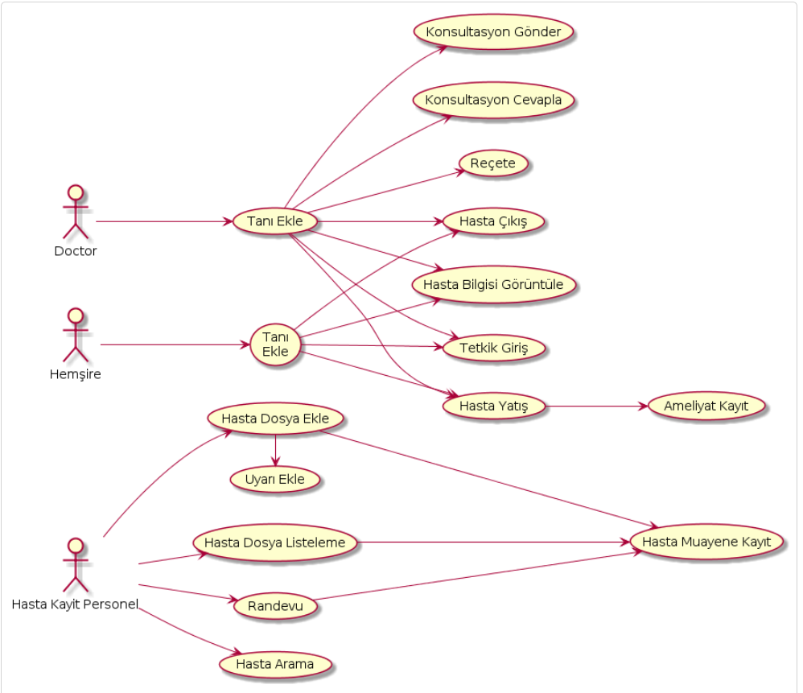
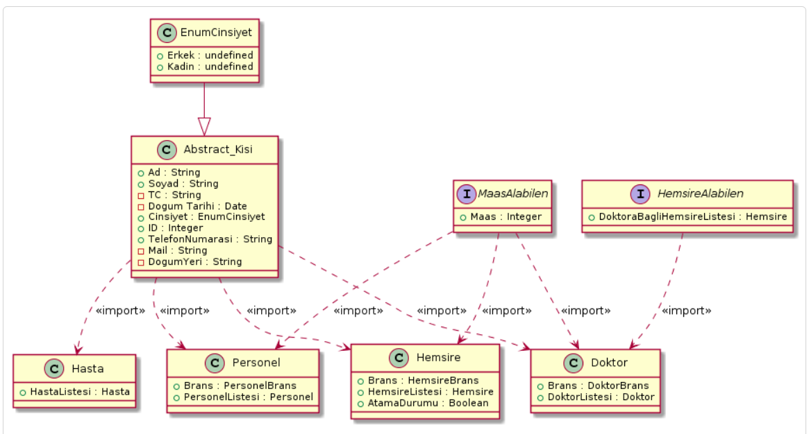

# Tasarim_Oruntuleri_1


= Hastane Poliklinik Otomasyonu

=== [blue]#Tasarim Örüntüleri Ders Ödevi#
=== 1) Projenin Amacı 
Yazılımın ana hedefi, herhangi bir hastanenin gereksinimlerini karşılayacak düzeyde bir ticari yazılımdır. Ayrıca hastanedeki işlemleri hızlandırmak ve kolaylaştırmaktır. Herhangi bir hastanede hastaların, doktorların ortak bir veritabanı üzerinden işlemlerini takip edebilmelerini ve birimler arasında uyumlu çalışmalarını sağlamaktır. Bu yazılım, hastanenin bütün kaynaklarının (zaman, insan gücü, mal, vs.) en etkin şekilde kullanılmasına olanak verir. Önceleri elle takip edilen evrak ve yapılan işlemler, bu yazılım sayesinde bilgisayar tarafından takip edilir ve yönetilir. İdare ve sağlık birimleri arasında hem lokal, hem de global entegrasyon yapılarak, zaman kaybının minimuma indirilmesi mümkündür. 

=== 2) Projenin Kapsamı 
Hastane Poliklinik Bilgi sistemi, hastanelerin sürekli ve gerçek zamanlı olarak izlenebilmesini sağlamaktadır. Bu hizmetin ana beklentisi sadece mevcut iş akışının otomasyonunu sağlayan teknolojik bir alt yapıya sahip olmak değil, bundan çok daha önemlisi daha iyi kalitede sağlık hizmeti sunabilmek, kağıt ortamından kağıtsız ortama doğru pratik dönüşümü sağlayabilmek ve sağlık verilerinin tüm sağlık paydaşları için ulaşılabilir olmasını sağlayacak entegre ve beraber çalışabilir kağıtsız bir sağlık hizmeti ortamı sunmaktır.

= Maddeleri Listeleme :

=== [green]#Numaralı Maddeler#

=== Planlama :
. Projenin Amacı ve Kapsamı 
. Projenin Hedefleri
. Projenin Varsayımları
. Projenin Engelleri

=== [green]#Numarasız Maddeler#

=== Projenin Hedefleri :
* Randevu işlemlerinin yapılması 
* Muayene kaydı ve polikliniklere yönlendirme yapılması
* Hasta yatış-çıkış işlemlerinin yapılması
* İlaç ve malzeme serfiyatı yapılması 
* Ameliyathaneye sevk ve ameliyat işlemlerini takibi
* Poliklinik listesinin tutulması

=== Hastane Poliklinik Bilgi Sisteminin UML Diyagramları :
=== A) Use-Case Diyagramı :
.Use-Case Diyagramı
[#img-usecase]
[caption="Figure 1: "]

=== B) Class Diyagramı :
.Class Diyagramı
[#img-class]
[caption="Figure 1: "]



= Uyarı Blokları :

ifdef::env-github[]
:tip-caption: :bulb:
:note-caption: :information_source:
:important-caption: :heavy_exclamation_mark:
:caution-caption: :fire:
:warning-caption: :warning:
endif::[]

[NOTE]
====
NOTE uyarı bloğu istenilen notları eklemek için kullanılır !!

AsciiDoc'ta birden fazla uyarı bloğu mevcuttur bunlar aşağıdaki gibi sıralanmakta :

* NOTE
* TIP
* WARNING
* CAUTION
* IMPORTANT
====

[TIP]
====
Bu blok öneri için kullanılır.

====
[WARNING]
====
Uyarı için kullanılır.

====
[IMPORTANT]
====
Önemli notları eklemek içindir.

====

[CAUTION]
====
Dikkat edilmesi gereken kuralları gösterilir.

====

= Linkleri Ekleme :

=== [red]#Externnal Links :#

https://www.linkedin.com/ - automatic!

https://www.linkedin.com/[LinkedIN]

https://github.com/asciidoctor[Asciidoctor@*GitHub*]

=== [red]#With spaces and special characters :#

link:++https://example.org/?q=[a b]++[URL with special characters]

link:https://example.org/?q=%5Ba%20b%5D[URL with special characters]

=== [red]#Relative :#

link:index.html[Docs]

=== [red]#Link with attributes(Asciidoctor Only) :#

http://discuss.asciidoctor.org[Discuss Asciidoctor, role="external", window="_blank"]

http://discuss.asciidoctor.org[Discuss Asciidoctor^]

https://example.org["Google, Yahoo, Bing^", role="teal"]

=== [red]#Inline anchors :#

[[bookmark-a]]Inline anchors make arbitrary content referenceable.

[#bookmark-b]#Inline anchors can be applied to a phrase like this one.#

anchor:bookmark-c[]Use a cross reference to link to this location.

[[bookmark-d,last paragraph]]The xreflabel attribute will be used as link text in the cross-reference link.

=== [red]#Internal cross references :#

See <<paragraphs>> to learn how to write paragraphs.

Learn how to organize the document into <<section-titles,sections>>.

= Resim Ekleme :

==== Block Images Ekleme :


.Dağ gün batımı
[#img-sunset]
[caption="Figure 1: ",link=https://www.flickr.com/photos/javh/5448336655]


image::https://asciidoctor.org/images/octocat.jpg[Github mascot]


==== Inline Images Ekleme :

Partiyi başlatmak için  düğmeyi basınız.

Ara vermek için image:icons/stop.png[title="Pause"] durdurma düğmesini basınız.

==== Inline Image with positioning role :

 Gün batımı ne kadar güzel !!

==== Embedded Images :
===== [gray]#Document title#
:data-uri:


= Video Ekleme :

==== Block Videos Ekleme :

video::video_file.mp4[]

video::video_file.mp4[width=540,start=60,end=140,options=autoplay]

==== Embedded Youtube Video Ekleme :

====== [green]#Observer Pattern ile ilgili bir youtube videosu :#

video::https://www.youtube.com/watch?v=_BpmfnqjgzQ[youtube]

= C++ Kaynak Kodu Ekleme :

==== [green]#Code block with title and syntax highlighting :#
.Hello_World.cpp
[source,c++]
----
#include <iostream>
using namespace std;

int main() 
{
    cout << "Hello, World!";
    return 0;
}
----
==== [green]#Listing block with title, no syntax highlighting :#
.Hellow_World.cpp
----
#include <iostream>
using namespace std;

int main() 
{
    cout << "Hello, World!";
    return 0;
}
----

==== [green]#Inline(monospace only) :#

Reference code like `types` or `methods` inline.

==== [green]#Inline(literal) :#

Output literal text such as `+{backtick}+` by enclosing the text in pluses, then in backticks.

==== [green]#linux bash script kod :#

```sh
# print the contents of foo.txt to STDOUT
$ cat foo.txt ls
$ dir
$ mkdir yeniDosya

```
= Tablo Ekleme :

==== [Red]#Table with two columns, a header, and two rows of content :#

==== [green]#Risk Analizi (Teknink) :#

[%header ,cols=2*]
|===
|Teknik Riskler 
|Azaltma ve/veya Ortadan Kaldırma Yöntemi 

|İletişim Altyapısının Yetersizliği 
|Gerekli Ağ altyapısının kurulması ile giderilir.

|Gizlilik ve Güvenliğin Sağlanması 
|Gerekli güvenlik elamanlarının alınması ve kullanıcı kontrolü ile giderilebilir.
|===
