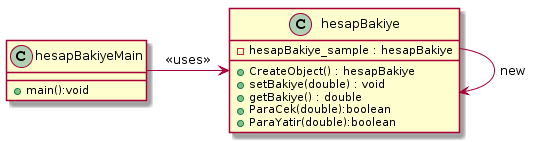

## Yarartımsal(Creational) tasarım desenleri:
Bu paternler, yazılım nesnelerinin nasıl yaratılacağı hakkında genel olarak öneriler sunarak kullandığı 
esnek yapı sayesinde daha önceden belirlenen durumlara bağlı olarak gerekli nesneleri yaratır. Yaratımsal(Creational) desenler, 
hangi nesnenin çağrılması gerektiğini izlemeden sistemin uygun nesneyi çağırmasını sağlayan tasarım kalıplarıdır. 
Nesnelerin yaratılması gerektiği durumlarda uygulamaya farkedilebilir bir esneklik katar. Esas amaç, 
iyi bir yazılımın içinde barındırdığı nesnelerin nasıl yaratıldığından bağımsız olarak tasarlanması gerekliliğidir.

### * Singleton Pattern: 
Creatinal patterns grubuna ait singleton tasarım deseni (Singleton design pattern) bir nesnenin application pool kapanana kadar 
bir kez üretilmesini kontrol altında tutar. Aynı zamanda bu nesne sınıf dışından da erişilebilinir olur. 
Bir sınıfın bir anda sadece bir örneğinin olması istenildiği zamanlarda kullanılır. 
Örneğin veritabanı uygulamalarında bir anda bir bağlantı nesnesinin olması sistem 
kaynaklarının verimli bir şekilde kullanılmasını sağlar.
 
Bu desenin kullanımı oldukça basittir. Singleton deseni uygulanacak sınıfın constructor(yapıcı) metodu private yapılır ve 
sınıfın içinde kendi türünden static bir sınıf tanımlanır. Tanımlanan bu sınıfa erişimi sağlayacak bir metot veya property de sınıfa eklenir. 

#### Singleton tasarım deseninin uml şeması aşağıdaki gibidir :

image::Donem_Projesi_Uml/singleton_pattern_genel_uml_diagram.jpg[230,250]

#### Örnek:
Bu patern Bir sınıfın bir anda sadece bir örneğinin olması istenildiği zamanlarda kullanıldığından dolayı biz de Hesap Bankalarında olan hesap Bakiyesi nesnesi için kullandık sonuçta 
tek nesne yaratılmak istenir ve yapaılan değişiklikler(Para yatırma ,Para çekme işlemleri vb.) aynı nesne üzerinden yapılacatır.
. Örnek uygulamamızda hesapBakiye sınıfının sadece örneğine
erişebilen public static bir metot oluşturulmuştur(CreateObject() metodu). Bu metot eğer sınıfın örneği
oluşturulmadıysa oluşturur ve oluşturulmuş olan
örneği döndürür.Uygulamanın class diyagramlari aşağıdaki gibidir.

#### *Singleton Pattern Ornegi icin UML class diyagram :

#### *Singleton Pattern Örneğin Kodları:

.hesapBakiye.java
[source, java]
----
package Singleton_Pattern;

public class hesapBakiye {
	
	private static hesapBakiye hesapBakiye_sample;
	private double h_Bakiye;
	
	protected hesapBakiye(){
		// Default Constructor
	}
	
	public static hesapBakiye CreateObject(){
		if (hesapBakiye_sample == null){
			
			hesapBakiye_sample = new hesapBakiye();
		}
		return hesapBakiye_sample;
	}
	
	public void setBakiye(double value){
		h_Bakiye = value;
	}
	public double getBakiye(){
		return h_Bakiye;
	}
	
	public boolean ParaCek(double cekilenPara){
		if(cekilenPara <= h_Bakiye){
			h_Bakiye = h_Bakiye-cekilenPara;
			return true;
		}else {
			return false;
		}	
	}
	public boolean ParaYatir(double yatirilanPara){
		try{
			h_Bakiye = h_Bakiye + yatirilanPara;
			return true;
		}catch (ArithmeticException e){
			return false;
		}
		
	}
	
}
----
.hesapBakiyeMain.java
[source, java]
----
package Singleton_Pattern;
import java.util.Scanner;
public class hesapBakiyeMain {

	private static Scanner scanner;

	public static void main(String[] args) {
		scanner = new Scanner(System.in);
		hesapBakiye obj1 = hesapBakiye.CreateObject();
		hesapBakiye obj2 = hesapBakiye.CreateObject();
		hesapBakiye obj3 = hesapBakiye.CreateObject();
   
		obj1.setBakiye(2000);
		
		System.out.println("### Singleton Design Pattern's Example is Runing ###\n");

		System.out.printf("obj1-Bakiye : %.2f \n", obj1.getBakiye());
		System.out.printf("obj2-Bakiye : %.2f \n", obj2.getBakiye());
		System.out.printf("obj3-Bakiye : %.2f \n\n", obj3.getBakiye());
		
		obj2.setBakiye(3000);
		
		System.out.printf("obj1-Bakiye : %.2f \n", obj1.getBakiye());
		System.out.printf("obj2-Bakiye : %.2f \n", obj2.getBakiye());
		System.out.printf("obj3-Bakiye : %.2f \n", obj3.getBakiye());
		
		System.out.println("\nYatırılacak Paranın Tutarını Giriniz Lütfen (Double Number) :");
		double yatirilanPara = scanner.nextDouble();
		
		if(obj2.ParaYatir(yatirilanPara)){
			System.out.printf("%.2f TL Hesabınıza Başarıyle Yatırıldı !!",yatirilanPara);
			
			System.out.printf("\nobj1-Bakiye : %.2f \n", obj1.getBakiye());
			System.out.printf("obj2-Bakiye : %.2f \n", obj2.getBakiye());
			System.out.printf("obj3-Bakiye : %.2f \n", obj3.getBakiye());
		}else{
			System.out.println("Lütfen istenilen kriterlere uygun bir sayı giriniz !!");
		}
		
		
	}

}
----
#### Result:
[source, ]
----
### Singleton Design Pattern's Example is Runing ###

obj1-Bakiye : 2000,00 
obj2-Bakiye : 2000,00 
obj3-Bakiye : 2000,00 

obj1-Bakiye : 3000,00 
obj2-Bakiye : 3000,00 
obj3-Bakiye : 3000,00 

Yatırılacak Paranın Tutarını Giriniz Lütfen (Double Number) :
250
250,00 TL Hesabınıza Başarıyle Yatırıldı !!
obj1-Bakiye : 3250,00 
obj2-Bakiye : 3250,00 
obj3-Bakiye : 3250,00 
----
#### *Multi Thread Singleton Pattern Örneğin Kodları:

.hesapBakiyeThread.java
[source, java]
----
package multiThreadSingleton;

public class hesapBakiyeThread {
	
	private static hesapBakiyeThread hesapBakiye_sample;
	private double h_Bakiye;
	
	protected hesapBakiyeThread(){
		// Default Constructor
	}
	
	private static Object lock_obj = new Object();
	
	public static hesapBakiyeThread CreateObject(){
		if (hesapBakiye_sample == null){
			
			synchronized (lock_obj){
				if(hesapBakiye_sample == null){
					hesapBakiye_sample = new hesapBakiyeThread();
				}
			}
		}
		return hesapBakiye_sample;
	}
	
	public void setBakiye(double value){
		h_Bakiye = value;
	}
	public double getBakiye(){
		return h_Bakiye;
	}
	
	public boolean ParaCek(double cekilenPara){
		if(cekilenPara <= h_Bakiye){
			h_Bakiye = h_Bakiye-cekilenPara;
			return true;
		}else {
			return false;
		}	
	}
	public boolean ParaYatir(double yatirilanPara){
		try{
			h_Bakiye = h_Bakiye + yatirilanPara;
			return true;
		}catch (ArithmeticException e){
			return false;
		}
		
	}
	
}
----
.hesapMainThread.java
[source, java]
----
package multiThreadSingleton;

public class hesapMainThread {

	public static void main(String[] args) {
		// TODO Auto-generated method stub
		System.out.println("### MultiThread Singleton Design Pattern's Example is Runing ###\n");

		hesapBakiyeThread obj1 = hesapBakiyeThread.CreateObject();
		hesapBakiyeThread obj2 = hesapBakiyeThread.CreateObject();
		hesapBakiyeThread obj3 = hesapBakiyeThread.CreateObject();
   
		obj1.setBakiye(2500);
		
		System.out.printf("obj1-Bakiye : %.2f \n", obj1.getBakiye());
		System.out.printf("obj2-Bakiye : %.2f \n", obj2.getBakiye());
		System.out.printf("obj3-Bakiye : %.2f \n\n", obj3.getBakiye());
		
		obj2.setBakiye(3800);
		
		System.out.printf("obj1-Bakiye : %.2f \n", obj1.getBakiye());
		System.out.printf("obj2-Bakiye : %.2f \n", obj2.getBakiye());
		System.out.printf("obj3-Bakiye : %.2f \n", obj3.getBakiye());

	}

}
----

#### Result:
[source, ]
----
### MultiThread Singleton Design Pattern's Example is Runing ###

obj1-Bakiye : 2500,00 
obj2-Bakiye : 2500,00 
obj3-Bakiye : 2500,00 

obj1-Bakiye : 3800,00 
obj2-Bakiye : 3800,00 
obj3-Bakiye : 3800,00 
----
